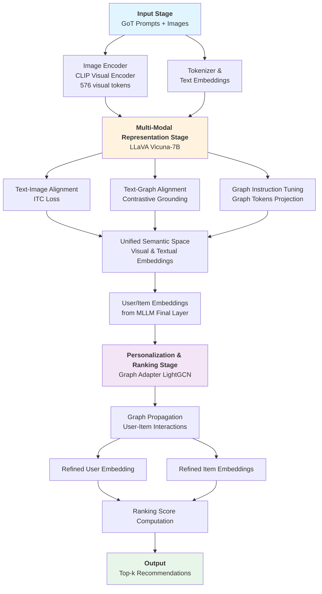

# Academic Paper Review: Multi-modal Large Language Model with Graph-of-Thought for Effective Recommendation

Review by Jason

## Introduction

In this paper, the authors address Large Language Model struggles with graph-structured data (like user-item purchase networks). They propose that even though Chain-of-Thought prompting works well for linear reasoning tasks, they generally struggle with graph relationships which degrades downstream performance on tasks like recommendation. Intuitively, this is like trying to explain relationships in a family tree using only a list format, it doesn't capture all the connections, thus crucial information is lost. To address this, the authors present a novel model architecture called *GollaRec*. It combines a multi-modal LLM (LLaVA) with a original *Graph-of-Thought* technique to recommend products. It uses both item images and text descriptions, plus user interaction graphs to make better recommendation predictions versus baseline state-of-the-art models. Rather than sequential reasoning, i.e., Chain-of-Thought, Graph-of-Thought structures prompts to explicitly encode user-item interaction graphs. The authors highlight three critical challenges in this approach. First, adaptive graph truncation using a pre-trained recommender to select high-potential items to address token constraints. Second, text-image alignment to unify visual and textual embeddings in a multi-modal context. Third, text-graph alignment combining *contrastive grounding* with graph instruction tuning to project graph representations like node embeddings into language-understandable graph tokens. Finally, they use a *graph adapter* integrates personalized user-item interactions into the final embeddings for ranking. The authors compare their work to nine different models across two separate domains and demonstrate performance improvements across the board. Additionally, the authors conduct several ablation studies to highlight the importance of each architectural component within their framework.

## Research Questions

1. How does the proposed GollaRec model perform compared with existing recommendation models?
2. How do the key components of GollaRec (GoT, Adapter, Text-graph Alignment, Text-image Alignment) affect the model's performance?
3. Does GollaRec exhibit better integration of item descriptions and images compared to the strongest baseline (BM3)?
4. How do the length of GoT and the position of demonstration steps affect the model's performance?

## Research Contributions

The authors summarize their contributions as follows.

1. **Novel Architecture**: GollaRec is a new recommendation model integrating user-item graph information within Graph-of-Thought (GoT). This is the first work to apply GoT prompting specifically for multi-modal recommendation tasks, directly addressing the insufficient graph mining problem in traditional Chain-of-Thought approaches.

2. **Graph Integration Methods**: Text-graph alignment combined with graph instruction tuning techniques to effectively capture and represent graph structural patterns within the user-item interaction network.

3. **Token Efficiency Solution**: An adaptive graph truncation method leveraging a pre-trained recommender to select and feed the maximum number of high-potential items into GoT while respecting the LLM's token length constraints.

4. **Comprehensive Empirical Validation**: Experiments on six benchmark datasets demonstrating that GollaRec significantly outperforms 12 strong baselines across both general and multi-domain recommendation tasks.

Contributions (1), (2), and (3) collectively represent novel architectural and algorithmic **methods**, i.e., Graph-of-Thought prompting, text-graph alignment with contrastive grounding, graph instruction tuning, and adaptive truncation—forming a new methodology for integrating structured graph data into multi-modal LLM-based systems. Contribution (4) and accompanying ablation studies establish empirical **knowledge** about technique effectiveness, showing that GoT outperforms CoT for graph tasks, text-image alignment significantly impacts performance. Note when referencing the paper that the authors number their contributions (1), (2), (4), (5), skipping (3) without explanation.

## System Architecture

While not explicitly stated as such, GollaRec's architecture comprises three interconnected stages.

1. Input processing via Graph-of-Thought prompting
2. Semantic representation through a multi-modal LLM
3. Personalization and ranking through graph-based adaptation.

Input & Prompting Stage: The system accepts two types of input, item images and textual GoT prompts containing user interaction sequences and candidate item descriptions. The GoT prompt is adaptively truncated to fit within LLaVA's 2048-token budget, with a pre-trained recommender (LightGCN) selecting the most promising candidate items. This ensures sufficient graph information is encoded without exceeding token constraints.

Multi-Modal Representation Stage: The frozen CLIP visual encoder processes item images into visual tokens (576 tokens total), while the LLaVA language model processes textual descriptions and graph information. During training, two alignment mechanisms enhance representation quality. (a) Text-image alignment via contrastive pre-training unifies visual and textual embeddings into a coherent semantic space. (b) Text-graph alignment combines contrastive grounding, aligning BERT text encodings with graph transformer node embeddings, and graph instruction tuning, projecting node embeddings into language-interpretable "graph tokens". Together, these produce unified user and item embeddings from LLaVA's final layer.

Personalization & Ranking Stage: A graph adapter (LightGCN) integrates user-item interaction information into the MLLM-derived embeddings, propagating structural patterns through the graph to refine representations for the ranking task. Final embeddings are used to compute relevance scores and produce the top-k recommendation list for the target user.

For context, LightGCN is a simplified graph convolutional network (GCN) designed for collaborative filtering in recommender systems. The authors spend little time explaining this component.[2]

## Methodology

The authors evaluate GollaRec on six benchmark datasets across two recommendation tasks. For general recommendation, they use three Amazon Review datasets (HM, Clothing, Baby). For multi-domain recommendation, they use seven domains from Amazon Reviews: Food, Home, Clothing, and Office as source domains, with Pantry, Electronics, and Sports as target domains. All datasets feature user-item interactions and multi-modal data, i.e., item images and textual descriptions. Datasets are randomly partitioned into training, validation, and test sets using an 8:1:1 ratio. Hyperparameters are optimized via grid search on the validation set for both GollaRec and baseline models. The authors employ two standard recommendation metrics. **Recall@20** to measures the proportion of relevant items that appear in the top-20 recommendations and **NDCG@20** (Normalized Discounted Cumulative Gain), that accounts for ranking position where lower positions are penalized more heavily. Results are reported as average performance across all users in the test set. The authors compare against the following baseline models for the conduct of their experiment across two separate tasks.

### General Recommendation Task (10 baselines)

#### General Recommender

- **LightGCN** A light graph neural network that learns user and item embeddings through neighborhood aggregation on the user-item interaction graph.

#### Multi-modal Recommenders

- **VBPR** Integrates visual features with user/item IDs using matrix factorization for recommendation.
- **MMGCL** Applies modality edge dropout and modality masking augmentations to concatenated multi-modal embeddings using self-supervised learning.
- **BM3** Bootstraps latent user/item representations through contrastive learning by reconstructing the user-item interaction graph.

#### MLLM Methods

- **CLIP** Uses a dual-stream transformer to encode image-text pairs; rankings computed via dot products between visual and textual embeddings.
- **BEiT-3** Unified transformer with mixture-of-modality-experts replacing feed-forward networks; rankings computed similarly to CLIP.
- **LLaVA** Combines frozen CLIP visual encoder with a large language model; uses item description sequences for user profile estimation.

#### Language-based Recommenders

- **P5** Pre-trained T5 model that converts recommendation tasks into tailored natural language sentences using personalized prompts.
- **LMRecSys** Transforms the recommendation task into a language modeling task by converting user interaction sequences into natural language queries.
- **TALLRec** A tuning framework that aligns large language models with the recommendation task.

### Multi-domain Recommendation Task (9 baselines)

All multi-modal methods listed above (VBPR, MMGCL, BM3, CLIP, BEiT-3, LLaVA), plus the following models.

#### Multi-domain Recommenders

- **MOME** Uses multiple expert networks with a gating mechanism to select relevant experts for each target domain.
- **PLE** Distinguishes between task-shared and task-specific experts with progressive routing for dynamic expert selection.
- **MGFN** Uses Graph Attention Networks to learn both intra-domain and inter-domain knowledge for cross-domain recommendations.

### Ablation Studies

The authors conduct ablation studies on four key components using the Clothing dataset (general task) and Sports dataset (multi-domain task).

- **w/o GoT** Removes GoT and retains the initial task description prompt. Results show GoT is essential—removing it significantly degrades performance across both datasets.
- **w/o Adapter** Removes the LightGCN graph adapter. Performance drops substantially, confirming that integrating user-item interactions through the adapter is necessary for capturing domain-specific knowledge.
- **w/o Text-image Alignment** Removes the contrastive pre-training alignment between item images and descriptions. Performance degrades, highlighting the importance of learning coherent multi-modal relationships.
- **w/o Text-graph Alignment** Removes text-graph grounding and graph instruction tuning. Performance declines in 3 of 4 instances, demonstrating that aligning graph structures with language is beneficial for interpreting graph patterns.

The authors also test sensitivity to prompt design choices with the following studies.

- **RandomDemonstrationPos** Randomly shuffles demonstration step positions within GoT. Performance remains comparable, suggesting step order is not critical.
- **RandomImagePos** Randomly repositions image prompts. No significant performance impact observed.
- **RandomLenTruncation (80% and 60%)** Constrains maximum token length. Performance degrades substantially with shorter limits, confirming that richer GoT content improves recommendations.

The authors conduct the following additional ablation studies.

- Cold-start user evaluation showing GollaRec provides larger improvements for users with sparse interactions (up to 32% improvement)
- Hyperparameter sensitivity studies on image prompt count and temperature parameter
- Different LLaVA variant comparisons (Llama, Mistral, Vicuna models at 7B and 13B scales)

## Results & Analysis

### Performance Summary

**General Recommendation Task** GollaRec achieves improved performance across all three datasets (HM, Clothing, Baby). Compared to the strongest baseline BM3, GollaRec demonstrates an average improvement of 12.7% in Recall@20 across all datasets. The model consistently outperforms 12 competing baselines across both evaluation metrics. The authors verify statistical significance verified using paired t-tests with *Holm-Bonferroni correction*.

**Comparative Analysis by Baseline Category** GollaRec outperforms MLLM-based methods (CLIP, BEiT-3, LLaVA), suggesting these models fail to effectively adapt multi-modal input for recommendation without proper graph integration. The model also significantly surpasses language-based recommenders (P5, LMRecSys, TALLRec) and multi-modal methods (VBPR, MMGCL, BM3), indicating that GollaRec adapts MLLMs to leverage both visual and textual prompts alongside interaction graphs.

**Graph-of-Thought Effectiveness** GollaRec outperforms its GollaRec-CoT variant on all three datasets, demonstrating that structural encoding of user-item graphs provides critical advantages over sequential reasoning for recommendation tasks.

**Multi-domain Recommendation Task** GollaRec significantly outperforms all baselines across three target domains (Pantry, Electronics, Sports) in nearly all instances (58 of 60 metric comparisons). The authors emphasize that incorporating multi-modal item content alongside interaction graphs facilitates more effective transfer of semantic knowledge across domains.

**Embedding Alignment Quality** Visualization and MSE analysis reveal that GollaRec produces cohesively distributed item embeddings (average MSE: 1.66–0.12 across datasets) compared to the strongest baseline BM3 (average MSE: 12.23–5.87), demonstrating better integration of visual and textual modalities into a unified embedding space.

### Summary of Strengths

1. Comprehensive Evaluation: The paper rigorously evaluates across six datasets, compares against 12 strong baselines from diverse categories, conducts thorough ablation studies, and includes additional analyses (cold-start, hyperparameter sensitivity, embedding visualizations, case studies). This breadth provides strong evidence for effectiveness and design choices.
2. Clear Problem and Novel Solution: The authors identify insufficient graph mining in Chain-of-Thought and propose Graph-of-Thought as a targeted solution. This is the first application of GoT to multi-modal recommendation, representing genuine technical novelty addressing fundamental limitations.
3. Strong Empirical Results: GollaRec achieves 12.7% average improvement over the strongest baseline (BM3), with improvements up to 18.2% on individual datasets.

### Summary of Weaknesses

1. Lack of Practical Explanation for Technical Complexity: The paper presents highly technical components (text-graph alignment, graph instruction tuning, contrastive grounding, graph tokens projection) with minimal intuitive explanation of why each component is necessary or how they interact. The dense technical presentation assumes significant background knowledge, limiting accessibility and practical understanding for practitioners.
2. Insufficient Computational Resource Analysis: While Table 10 reports training time and inference time, the paper lacks direct comparison of computational costs versus baseline methods. The multi-step architecture appears computationally expensive, yet no analysis quantifies this overhead or trades computational efficiency for performance gains.
3. Manual Prompt Engineering and Limited Generalizability: The authors manually designed GoT demonstrations and selected prompts based on representative examples. While they report comparing with auto-generated prompts from LLaMA3 without significant difference, the reliance on manual design can lead to brittleness and reproducibility issues in a production setting. Additionally, results with different LLaVA variants (Llama-7B and Mistral-7B) show degraded performance, questioning broad generalizability across MLLM architectures.
4. Dependency on Pre-trained Recommender: The adaptive truncation method relies on LightGCN for initial candidate ranking. This creates architectural coupling, and integration of another recommender requires revalidation. The paper doesn't explore sensitivity to the quality of the initial ranking or whether other recommenders could serve this role.

### Questions

1. The multi-step architecture appears computationally expensive. While Table 10 shows training time and inference time, it lacks direct comparison with baseline methods. Can you provide a detailed computational cost breakdown (FLOPs, memory usage) comparing GollaRec to key baselines like BM3 and LLaVA? How much more expensive is the performance improvements of GollaRec?
2. All six evaluated datasets are from Amazon Reviews. How does GollaRec perform on non-e-commerce domains such as music recommendation, movie recommendation, or social networks where item visual characteristics may be less informative? Does the approach remain effective when item images provide less relevant information?
3. The adaptive truncation method relies on LightGCN to select high-potential items up-front. How sensitive is GollaRec's performance to the quality of this initial ranking? Have alternative recommenders been tested?

---

## Reference

1. [A Multi-modal Large Language Model with Graph-of-Thought for Effective Recommendation](https://aclanthology.org/2025.naacl-long.76/) (Yi & Ounis, NAACL 2025)
2. [LightGCN: Simplifying and Powering Graph Convolution Network for Recommendation](https://arxiv.org/abs/2002.02126) (He et al., SIGIR 2020)
