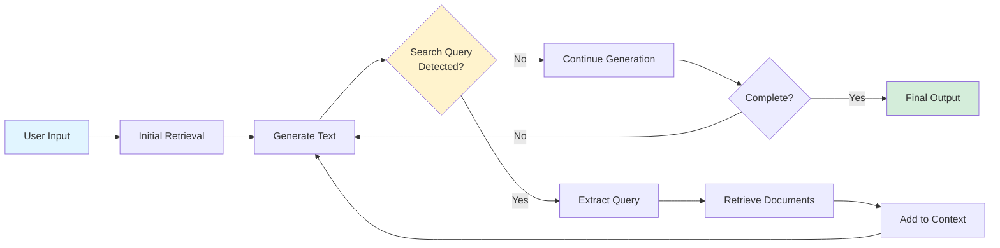
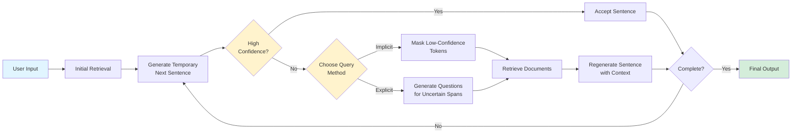
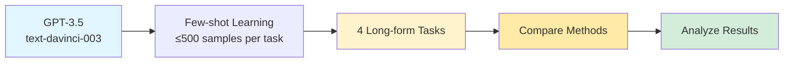

# Paper Review: Active Retrieval Augmented Generation

**Authors:** Zhengbao Jiang, Frank F. Xu, Luyu Gao, Zhiqing Sun, Qian Liu, Jane Dwivedi-Yu, Yiming Yang, Jamie Callan, Graham Neubig
**Conference:** EMNLP 2023
**Date:** October 20th, 2025

---

## Paper Summary

### Introduction

This paper addresses the hallucination problem in large language models (LLMs) through retrieval augmentation. Existing retrieval-augmented LLMs retrieve information only once based on the initial user input or prompt, which works for well short-form tasks but less so for long-form generation where information needs evolve or address varying elements of specific information during generation.

The authors propose **FLARE (Forward-Looking Active REtrieval augmented generation)**, which actively *decides* when and what to retrieve throughout generation. They primary version of FLARE presented by the authors iteratively generates a temporary next sentence, retrieves documents if it contains low-confidence tokens, and regenerates the sentence with retrieved context for a more precise response. This retrieval method aims to generalize well and most notably requires no additional LLM training. It is evaluated on 4 long-form tasks using GPT-3.5-turbo, demonstrates improved performance against single-time and multi-time baseline retrieval baselines.

The 4 long-form tasks evaluated in this paper are as follows. First is **Multihop QA** (2WikiMultihopQA) which answers questions requiring multi-step reasoning across documents. Next is called **commonsense reasoning** (StrategyQA) which involves yes/no questions requiring broad knowledge and chain-of-thought. Next task is **long-form QA** (ASQA) which aims to generate comprehensive answers covering multiple interpretations of ambiguous questions. The final task is called **open-domain summarization** (WikiAsp) which is generating aspect-based summaries by retrieving information from the open web.

### Research Questions

The authors explicitly state *"Can we create a simple and generic retrieval augmented LM that actively decides when and what to retrieve throughout the generation process, and are applicable to a variety of long-form generation tasks?"*

This question breaks down into two parts:

1. At what points during generation should the system access external knowledge?

2. What queries should be used to retrieve relevant information at each retrieval step?

The authors hypothesize that (1) LMs should retrieve only when they lack necessary knowledge (as expressed by confidence and avoiding unnecessary retrieval) and (2) retrieval queries should reflect what LMs intend to generate in the future, not just past context, hence "forward-looking".

### Research Contributions

The authors contribute a **new method** as a novel active retrieval augmented generation framework that determines when and what to retrieve during generation based on LLM uncertainty during generation. They propose FLARE with two implementations. (1) FLARE-instruct which prompts LLMs to generate explicit search queries and (2) FLARE-direct that uses temporary forward-looking sentences as queries, triggered by low-confidence tokens.

The authors also provide **new empirical insights** demonstrating that forward-looking retrieval outperforms backward-looking retrieval using past context. They demonstrate the method's ability to generalize across 4 diverse long-form generation tasks, systematically comparing against single-time retrieval and three multi-time retrieval baseline categories.

### System Architecture

Both FLARE variants start with an initial retrieval using the user input, then iteratively generate output sentence-by-sentence. The key differences lie in how they decide when to retrieve and how to formulate queries.

FLARE-instruct uses few-shot prompting to teach the LLM two skills simultaneously, (1) generating search queries using "[Search(query)]" syntax when additional information is needed, and (2) performing the downstream task. During generation, the LLM produces text with with search queries. When the system detects "[Search(query)]" in the output, it halts generation, extracts the query terms, retrieves relevant documents, and prepends them to the input context. Generation then resumes with the enriched context, continuing this cycle until completion. This approach relies on the LLM's ability to self-identify information needs through few-shot learning, though the authors note that query quality may be unreliable.

FLARE-direct uses a confidence-based approach that first generates a temporary next sentence without retrieved documents. The system then evaluates whether all tokens in this sentence have probabilities above a set threshold. If all tokens meet the threshold, the sentence is accepted as-is. Otherwise, retrieval is triggered and the system formulates a query using one of two methods, (1) implicit query formulation masks out tokens with probabilities below the threshold, while explicit query formulation uses GPT-3.5-turbo to generate questions targeting the low-confidence spans. After retrieving documents with the formulated query, the system regenerates the sentence conditioned on the retrieved context and previous generation. This process iterates until the full answer is generated, with retrieval occurring only when the model exhibits uncertainty.

### Methodology

The authors evaluate FLARE on four diverse long-form knowledge-intensive generation tasks using few-shot in-context learning with GPT-3.5 (text-davinci-003). Due to API costs, they subsample at most 500 examples from each dataset. Hyperparameters are selected based on development sets.

#### Tasks and Evaluation

| Task | Dataset | Description | Metrics | Exemplars | Retriever |
|------|---------|-------------|---------|-----------|-----------|
| **Multihop QA** | 2WikiMultihopQA | Answer 2-hop questions requiring reasoning across Wikipedia articles | EM, F1, Precision, Recall | 8 | BM25 (Wikipedia) |
| **Commonsense Reasoning** | StrategyQA | Generate chain-of-thought + yes/no answer | EM | 6 | BM25 (Wikipedia) |
| **Long-form QA** | ASQA / ASQA-hint | Generate comprehensive answers covering multiple interpretations of ambiguous questions | EM, Disambig-F1*, ROUGE-L, DR** | 8 | BM25 (Wikipedia) |
| **Summarization** | WikiAsp | Generate aspect-based summaries from open web | UniEval***, Entity-F1, ROUGE | 4 | Bing Search API |

#### Evaluation Metrics:

- EM (Exact Match): Binary accuracy - predicted answer exactly matches gold answer
- F1, Precision, Recall: Token-level overlap between predicted and gold answers
- Disambig-F1: RoBERTa-based QA model score measuring coverage of multiple answer interpretations
- ROUGE-L: Longest common subsequence between generated and reference text
- DR (Overall Score): Combines Disambig-F1 and ROUGE for comprehensive long-form QA evaluation
- UniEval: Neural metric assessing factual consistency of generated summaries
- Entity-F1: Named entity overlap between generated and reference summaries

#### Baseline Comparisons

| Method Category | Retrieval Timing | Query Source | Examples |
|-----------------|------------------|--------------|----------|
| No Retrieval | Never | N/A | Standard LM |
| Single-time | Once at start | User input | Standard RAG |
| Previous-window | Every 16 tokens | Previous 16 tokens | RETRO, IC-RALM, KNN-LM |
| Previous-sentence | Every sentence | Previous sentence | IRCoT |
| Question decomposition | When sub-question generated | Manual sub-questions in exemplars | Self-ask |
| **FLARE** | **When low-confidence tokens detected** | **Forward-looking temporary sentence** | **FLAREinstruct, FLAREdirect** |

### Results & Analysis

#### Performance

FLARE achieves superior or competitive performance across all four tasks compared to all baselines. The method shows the most significant improvement on multihop QA (2WikiMultihopQA), where FLAREdirect achieves 51.0% EM compared to 47.8% for the best baseline (question decomposition) and 39.4% for single-time retrieval. On StrategyQA, FLARE reaches 77.3% EM versus 72.9% without retrieval. For long-form QA, FLARE achieves 41.3% EM and 31.1% DR on ASQA, and 46.2% EM and 37.2% DR on ASQA-hint. On WikiAsp summarization, FLARE achieves 53.4% UniEval score, outperforming all baselines. Notably, FLAREinstruct significantly underperforms FLAREdirect (42.4% vs 51.0% EM on multihop QA), suggesting that teaching LMs to generate reliable search queries through prompting alone is challenging.

#### Ablation Studies

Forward-looking retrieval outperforms backward-looking retrieval across tasks, validating the core hypothesis. On Multihop QA, next-sentence retrieval achieves 48.8% EM versus 39.0% for previous-sentence. Active retrieval based on confidence thresholds proves critical as performance plateaus when retrieval occurs for 60%+ of sentences on multihop QA, and actually degrades beyond 50% on StrategyQA, demonstrating that unnecessary retrieval introduces noise to the LLM. The optimal retrieval rate is 40-80% of sentences depending on the task. Query formulation methods (implicit masking vs explicit question generation) perform similarly, both effectively addressing the risk of perpetuating errors in temporary sentences. Using too many past tokens (>32) as queries degrades performance, further confirming that past context poorly reflects future generation intent.

---

## Summary of Strengths

The core innovation of using anticipated future content (temporary next sentences) as retrieval queries, rather than past context, demonstrates substantial empirical gains. The ablation studies convincingly show that forward-looking retrieval outperforms backward-looking approaches across all tasks (e.g., 48.8% vs 39.0% EM on multihop QA), validating the key hypothesis that retrieval queries should reflect generation intent rather than past output.

The use of token-level probability thresholds to trigger retrieval only when needed is both theoretically sound and empirically effective. The finding that optimal retrieval rates are 40-80% of sentences—and that excessive retrieval degrades performance—provides valuable insights about the balance between accessing external knowledge and avoiding noise. This approach elegantly addresses the inefficiency of fixed-interval passive retrieval methods.

---

## Summary of Weaknesses

The iterative "interleaving" of generation and retrieval significantly increases computational overhead and API costs compared to single-time retrieval. The authors acknowledge in the limitations that the LLM must be activated multiple times (once per retrieval event), and without caching, previous activations must be recomputed after each retrieval. While the method retrieves for only 40-80% of sentences (better than fixed-interval approaches), it still requires generating temporary sentences that may be discarded, effectively doubling generation for retrieved sentences. The paper provides no timing comparisons or cost analysis, making it difficult to assess the practical trade-off between performance gains and computational expense.

The primary evaluation metric across three of four tasks is Exact Match (EM), which is syntax-based and fails to capture semantic equivalence. For example, answers like "New York City" versus "NYC" or "Joe Biden" versus "Joseph Biden" would be marked incorrect despite being semantically identical. This is particularly problematic for multihop QA and commonsense reasoning where StrategyQA uses only EM. While ASQA includes Disambig-F1 and WikiAsp uses UniEval (more semantic metrics), the headline results in Figure 4 emphasize EM, potentially overstating or understating the true performance differences between methods.

Due to API costs, experiments are limited to at most 500 examples per dataset, which is a small fraction of the full datasets. This limited scale raises questions about statistical significance and generalizability of the reported improvements, particularly for smaller effect sizes. Additionally, the authors report that FLARE did not provide significant gains on two other datasets (Wizard of Wikipedia and ELI5), suggesting the method may not be universally applicable to all long-form generation tasks.

The confidence-based retrieval strategy assumes that low token probabilities reliably indicate lack of knowledge. However, this assumption may not hold for all models or all types of uncertainty (e.g., linguistic uncertainty vs. knowledge uncertainty). The method's effectiveness is demonstrated only on GPT-3.5, and calibration quality varies significantly across different LLM architectures.

---

## Questions

1. Computational Cost Analysis:
Can you provide quantitative comparisons of wall-clock time, API calls, and total cost versus baselines? At what performance gain does the additional computational expense become justified?

2. Model Generalizability Beyond GPT-3.5:
How does FLARE perform with other LMs (GPT-4, LLaMA, Claude, open-source models)? Does the optimal confidence threshold θ vary significantly across model families, and how sensitive is the method to calibration quality?

3. Semantic Evaluation:
Have you conducted human evaluations or semantic similarity analyses beyond Exact Match? Do the EM improvements translate to genuinely better answers that matter to end users?

## References

1. [Active Retrieval Augmented Generation](https://aclanthology.org/2023.emnlp-main.495/) (Jiang et al., EMNLP 2023)

2. [ACL Rolling Review, "Review Form"](https://aclrollingreview.org/reviewform)
