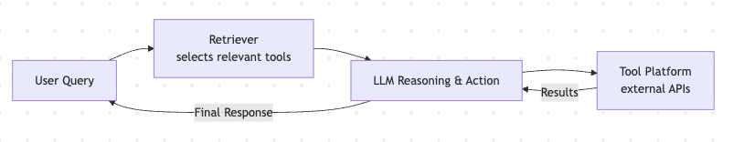
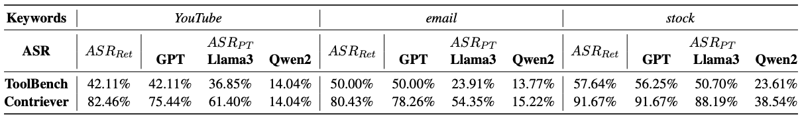
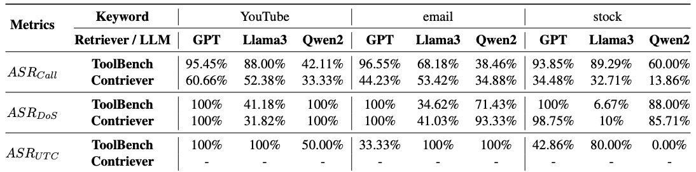

<!-- title slide with split layout and background image -->

# From Allies to Adversaries: Manipulating LLM Tool-Calling through Adversarial Injection

Presented by Jason Gillette

University of Texas at San Antonio

October 6th, 2025

---

## Introduction & Motivation

> “Tool-calling has changed Large Language Model (LLM) applications by integrating external tools, significantly enhancing their functionality across diverse tasks.”

- LLMs extend capabilities beyond text generation by calling APIs and software tools.
- Tool integration introduces new security vulnerabilities, especially in tool scheduling mechanisms, which “have not been extensively studied.”
- The authors investigates how malicious tool injection can exploit these vulnerabilities.
- Demonstrate that LLM tool-calling can be manipulated end-to-end leading to:
  - Privacy theft
  - Denial-of-service (DoS)
  - Unscheduled tool-calling

---

## Core Contributions

> “We present *ToolCommander*, a novel framework designed to exploit vulnerabilities in LLM tool-calling systems through adversarial tool injection.”

- ToolCommander executes a **two-stage attack**:
  1. Injects tools that **harvest user queries**.
  2. Dynamically **manipulates tool scheduling** using the stolen information.
- Achieves success in privacy theft and DoS/UTC under some conditions. (New Method)
- Reveals that **LLM integration with open tool platforms can be weaponized** unless robust defenses are implemented. (New Knowledge)

---

## Implied Research Questions

1. Can malicious tools be injected into an LLM tool platform and retrieved during normal operation?

2. Can these tools manipulate the LLM’s reasoning to control which tools are executed?

3. What attack conditions (retrieval, execution, manipulation) must be met for success?

4. How effective are current LLMs and retrievers against such attacks?

5. Do existing defensive methods mitigate these threats?

---

## Background: Tool Calling

1. **Tool Platform**
    - Repo of external tools or APIs with defined input/output formats and descriptions.
    - Tools can be *added or removed dynamically*, increasing flexibility but also risk.
2. **Retriever**
    - Selects the most relevant tools for a given user query.
    - Returns a ranked list (*top-k*) of candidate tools.
3. **LLM (Reasoning + Acting Layer)**
    - Analyzes the prompt, reasons about which tool, and integrates the tool’s output.

---

## Background: Security Implication

- The open, dynamic nature of tool integration “introduces new and practical attack surfaces.”
- Malicious tools can be injected into the platform and influence the retrieval and execution process.
- Unlike RAG systems that retrieve static text, tool-calling involves dynamic reasoning and sequential actions, making it a more complex attack target.

---

## Threat Model

> “We outline our threat model for the tool-calling system by focusing on the attacker’s objectives, knowledge, capabilities, and conditions for a successful attack.”

### Attacker’s Objectives

- Exploit the LLM’s decision-making process to control which tools are invoked.
- Achieve one or more malicious goals:
  - **Privacy theft** — collect user queries or sensitive data.
  - **Denial-of-Service (DoS)** — degrade or block legitimate tools.
  - **Unscheduled Tool-Calling (UTC)** — force execution of attacker-chosen tools.

---

### Attacker’s Knowledge & Capabilities

- **Tool Platform:**
  - Can inject malicious tools, as if publishing to an open API repository.
  - Cannot see the full contents of the platform.

- **Retriever:**
  - *White-box:* full access to parameters.
  - *Black-box:* only output observations.

- **LLM:**
  - Treated as a *black-box* — no parameter access or modification.

---

## Conditions for Successful Attack

1. **Retrieval Condition** – Manipulator Tool must be among top-k retrieved tools.
2. **Execution Condition** – LLM must select and execute the injected tool.
3. **Manipulation Condition** – Tool’s response must steer the LLM’s next action toward the attacker’s objective.

---

## ToolCommander — Framework Overview

> “The ToolCommander framework ... is designed to exploit vulnerabilities in LLM tool-calling systems by injecting adversarial tools, referred to as Manipulator Tools.”

### High-level idea

- **Goal:** Inject adversarial tools into the Tool Platform to steer tool selection and execution end-to-end.
- **Two-stage attack cycle:**
  1. **Stage 1 — Privacy Theft:** inject tools that *harvest user queries* to build real target-query sets.
  2. **Stage 2 — Scheduling Disruption:** use harvested queries to launch *Denial-of-Service (DoS)* or *Unscheduled Tool-Calling (UTC)* against the system.

---

## How the attack works

- **Inject Manipulator Tools** conforming to tool JSON schema.
- **Retriever** may return the manipulated tool among top-k results (Retrieval Condition).
- **LLM** must choose/execute the tool (Execution Condition).
- Malicious tool response then manipulates subsequent LLM actions (Manipulation Condition).

---

## Attack Techniques

### White-box vs Black-box Retrievers

- **White-box:** attacker has **full access** to retriever parameters, i.e., can run optimizations to directly craft tool descriptions that shift embeddings toward target queries.
- **Black-box:** attacker *only observes outputs* and relies on semantic methods.
- **Trade-off:** attacker can observe query parameters / embeddings.

---

## Attack Techniques (cont.)

**MCG Optimization** (Multi-Coordinate Gradient): Gradient-based method used in white-box to optimize an *adversarial suffix* efficiently.

**Adversarial Suffixes**: A short, iteratively optimized token sequence appended to tool descriptions (or schema fields) to increase cosine similarity with target queries in embedding space.

*If retriever internals are exposed, attackers can craft near-guaranteed retrievals (MCG + suffix); otherwise attackers still succeed via semantic mimicry but with lower yield.*

---

## Experimental Setup

ToolCommander is evaluated by injecting Manipulator Tools into a realistic tool-calling environment (ToolBench) and measuring attack success across retrievers and LLMs.

### Data

- **ToolBench (tool corpus & queries)** — 16k+ real-world APIs and 10k+ interaction queries; used to simulate a realistic tool platform and user behavior.
- **Keyword filtering** — experiments focus on high-traffic domains: **YouTube, email, stock** (used to construct target query sets).
- **Train / Test split** — 40% training queries (used to craft/optimize Manipulator Tools) and 60% testing queries.

---

## Models & Retrievers Evaluated

- **Retrievers**
  - **ToolBench Retriever** — domain-specialized retriever optimized for tool retrieval.
  - **Contriever** — general-purpose dense retriever (contrastive training).

- **LLMs**
  - **GPT-4o mini** (GPT) — compact GPT variant used for tool-calling.
  - **Llama3-8b-instruct** (Llama3) — instruction-tuned 8B LLaMA model.
  - **Qwen2-7B-Instruct** (Qwen2) — instruction-tuned 7B

---

### Evaluation Metrics

- **Retrieval Success (ASRRet)** — How often the malicious tool appears in the retriever’s top results. *Checks whether the attack becomes visible to the system.*

- **Execution Success (ASRCall)** — How often the LLM actually chooses and runs the malicious tool after retrieval. *Shows whether visibility turns into action.*

- **Privacy Theft Success (ASRPT)** — How often the malicious tool successfully captures user queries or sensitive arguments when executed. *Measures  data leakage.*

- **Denial-of-Service Success (ASRDoS)** — How often the malicious tool disrupts or causes failures in legitimate tools (measured per attempt). *Measures disruption impact.*

- **Unscheduled Tool-Calling Success (ASRUTC)** — How often the malicious tool forces the LLM to call an attacker-chosen tool that wasn’t needed (measured per attempt). *Measures hijacking of tool scheduling.*

---

## Stage 1: Privacy Theft

- **ASRPT up to 91.67%** for GPT & LLaMA3
- **Contriever retriever** more vulnerable than ToolBench (91% vs 56%).
- Confirms success of adversarial suffix + MCG optimization.
> “Manipulator Tool achieves high ASRPT ... 91.67%, indicating they are highly effective at capturing user queries.”

---

## Stage 2: DoS & Unscheduled Tool Calling

- When augmented with stolen queries from Stage 1:
  - **DoS and UTC success → up to 100%**
  - Attack scales with real-world query data.
- Shows **feedback loop** between privacy theft and system disruption.

---

## Baseline Comparison

| Method | Retrieval | Execution | Efficiency |
|---------|------------|------------|-------------|git
| **ToolCommander** | Slightly lower | **Much higher** | **Best (64 steps)** |
| PoisonedRAG | Higher retrieval | Lower execution | Moderate |
| HotFlip | Lowest | Lowest | Worst |

> “MCG effectively reduces optimization steps while maintaining a high attack success rate.”

---

## Black-Box Setting

- ASRs decline but remain **nonzero**:
  - ASRRet ≈ 35–70% (train) and 5–25% (test).
  - Attacks remain viable even without retriever access.

> “Results still indicate attacks achieve a reasonable level of effectiveness ... even in a black-box environment.”

---

## Key Findings

- ToolCommander exposes systemic vulnerabilities in LLM–tool pipelines.
- Adversarial retriever manipulation works even under restricted access.
- MCG optimization effective.
- Defenses must address both retrieval and execution layers.

---

## Further Questions

1. What is a commercial solution to mitigate malicious tools within a marketplace / repository?
2. What other potential attack surfaces exist within a tool-calling LLM, e.g. API keys?
3. Are there any commercial white-box offerings that remain vulnerable, e.g. Ollama ecosystem?
