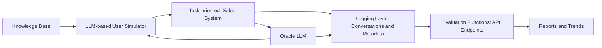

# Paper Review: AutoEval-ToD: Automated Evaluation of Task-oriented Dialog Systems, Jain et al

Review by Jason Gillette

## Introduction

This paper presents a novel approach to evaluating task-oriented dialog systems. Task-oriented dialog (ToD) systems, commonly referred to as chat bots or virtual assistants, are prolific across various industries and domains such as customer service, technical support, and product recommendation. Several key function underlay task-oriented dialog including natural language understanding, multi-turn conversation, and tooling / task execution, e.g., queries, data submission, etc. Evaluating performance of these systems is historically a supervised task involving human-in-the-loop or supervision via manually annotated data. Evaluations can prove expensive and difficult to scale while also being subject to human bias leading to some inherent shortfalls in true evaluations. Auto-eval ToD offers an unsupervised approach that enables a broader range of evaluation metrics and scalability without the expense and shortfalls of human-in-the-loop approaches. The authors provide Auto-eval ToD as a framework containing exposed endpoints, allowing for evaluation of task-oriented dialog systems across multiple domains. The framework implements large language models (LLM) as a simulation of user interactions with the ToD systems in addition to LLM-as-a-judge to perform evaluations across different performance metrics.

## Contributions

The authors provide the following contributions:

1) A generic evaluation framework that is generally suitable across ToD domains.
2) User interaction simulation via LLM that acts as a proxy for human end users.
3) A comprehensive evaluation.

The user simulation is dependent on a curated knowledge base from which it selects a "seed issue" to engage the target ToD with solving. Comprehensive evaluation uses a separate LLM and a known solution from the knowledge base to perform evaluations. Evaluation metrics are robust and span multiple categories to ensure a fine-grained snapshot of performance. Evaluation metrics will be discussed further in the [methodology section](#methodology) of this review. Overall, the contributions represent a significant advance in scaling ToD evaluations using large language models in place of expensive human evaluations.

### System Architecture

The proposed AutoEval-ToD framework is an end-to-end automated evaluation system consisting of the following major features.

- LLM-based dynamic user simulator to generate realistic multi-turn conversations seeded from known issues stored in a knowledge base.
- An oracle LLM validates whether the system’s suggested solution matches the correct outcome, while preventing solution leakage.
- Logging of both conversation transcripts and internal metadata (retrievals, rankings, latency, etc.) for further evaluation.
- API endpoints deliver system data to evaluations functions that collect and report performance data.
- System output of detailed reports and trend plots showing system strengths and weaknesses.

## Methodology

### Evaluation Dimensions

The authors present **five evaluations dimensions** each with their own set of empirical metrics that ensures a fine-grained evaluation that allows ToD developers to optimize their systems.

#### Retrieval Performance

Retrieval performance centers on how effectively the ToD system can retrieve relevant information from its knowledge base (separate from the Eval knowledge base). AutoEval-ToD measures retrieval performance within each dialog turn of a conversation. The framework tracks whether the system returns the correct content at the right point in the dialogue, using metrics such as HitRate@k and Mean Reciprocal Rank (MRR@k). These indicate not only whether the correct item was retrieved but also how prominently it appeared in the ranking. To test robustness, user inputs are intentionally varied in difficulty—from straightforward requests to ambiguous or complex inputs—allowing developers to see how well the retriever performs under different conditions.

- HitRate@k
- Mean Reciprocal Rank (MRR@k)

#### User Experience

Beyond technical retrieval, the framework evaluates how well the system serves users through several metrics. First, latency is measured both end-to-end and at the level of individual modules, offering insight into responsiveness and potential bottlenecks in the system architecture, e.g., query optimization. Goal Completion Rate (GCR) is calculated by checking how often the conversation results in a satisfactory resolution of the user’s intent, using a separate LLM-based similarity checker versus strict string matching as seen in traditional methods. Finally, the number of turns to resolution provides a sense of efficiency, i.e., optimizing for minimal back-and-forth. Together, these metrics capture the practical usability of the system as experienced by end users.

- latency
- Goal Completion Rate (GCR)
- Solution similarity

#### Turn Optimization

Since task-oriented dialogue often spans multiple turns, it is not enough to simply resolve queries over the span of many turns as efficiency in dialogue progression matters. AutoEval-ToD monitors how retrieval accuracy and resolution evolve at each turn of the conversation. Progressive HitRate@k and MRR@k show how quickly the system converges on the correct solution as more user information is revealed. In parallel, turn-level resolution rates reveal the proportion of conversations successfully resolved at each stage. This turn-by-turn lens highlights whether the system is improving as dialogue unfolds or if it unnecessarily prolongs the interaction.

#### Domain Compliance

Task-oriented systems often operate within regulated or domain-specific boundaries, such as troubleshooting, travel booking, or medical assistance. AutoEval-ToD checks whether system responses adhere to these constraints. For example, a troubleshooting bot should not recommend dangerous chemicals, and a hotel booking bot should not ask for sensitive personal details. To enforce this, the framework uses LLMs to evaluate each response against a predefined set of rules. Any violations are flagged with explanations, giving developers actionable feedback for aligning the system with domain requirements and ensuring safety, legality, and user trust.

#### Response Quality

The framework also assesses the quality of responses beyond whether they solve the problem. A suite of universal quality metrics is applied: factual correctness to confirm the accuracy of information; response completeness to ensure all relevant details are included; entailment to check logical consistency with the ongoing conversation; bias detection to screen for prejudiced or inappropriate outputs; empathetic tone to evaluate whether the system responds with sensitivity; and language correctness to ensure grammatical and syntactic accuracy. Together, these criteria offer a holistic assessment of how polished, trustworthy, and human-friendly the system appears to end users.

- factual correctness
- response completeness
- logical entailment
- bias detection
- empathetic tone
- language correctness

### Human Validation

An evaluation of task-oriented dialog needs to have a frame of reference relative to true human interaction to be representative of true performance. In order to validate the evaluation results of AutoEval-ToD, authors enlisted the assistance of a diverse group of human annotators that includes general users and domain experts and they assessed a subset of ToD conversations along some of the same metrics preformed by the evaluation. Validated metrics included solution checking, domain compliance, and response quality. Note other evaluation metrics like number of turns to solution response are more empirical in nature and do not require human judgement. The authors found **~94-97% agreement** between AutoEval-ToD and their human annotators indicating strong alignment between the automated and human based approaches.

## Results & Analysis

### Evaluation Across Domains

The authors applied AutoEval-ToD to three distinct ToD systems spanning different datasets and domains to show its general purpose applicability.

1. Troubleshooting ToD - This ToD is an industrial chatbot deployed in an e-commerce context to help users troubleshoot product-related issues. Built on Claude-3-Sonnet, it represents a real-world ToD system. Details of its proprietary implementation are confidential and not disclosed, so results are reported relative to the baseline Claude-3-Sonnet model. Empirical Results are presented along the metrics.

- Retrieval Performance: Near-perfect on easy queries (HitRate and MRR ≈ 99%). However, as the user simulation inputs increasingly ambiguous prompts, the system demonstrates lower performance on medium (HitRate@1 ≈ 86%) and even lower on hard queries (HitRate@1 ≈ 63%).

- User Experience: Goal Completion Rate improved by +19% over baseline (in comparison to baseline Claude model). Latency increased by +2.5s (P50) and +5.1s (P90), but average turns to resolution dropped by −2.1 turns.

- Domain Compliance: Improved adherence of +4–6% across four compliance rules.

- Response Quality: Gains across most metrics — Factual Correctness (+4.9%), Completeness (+4.0%), Empathy (+5.0%), Language Correctness (+5.0%), and small lift in Entailment (+0.8%).

This system is strong at resolving clear-cut problems but predictably struggles with ambiguous inputs. Its ability to complete more user goals with fewer turns shows efficiency gains, though at the cost of slower responses which is likely a result of retrieval mechanisms. The higher compliance rates reinforce trustworthiness in troubleshooting scenarios, while improved empathy and clarity indicate more user-friendly interactions. Limited improvement in entailment suggests it still occasionally loses coherence with conversation context which may indicate a deeper issue with the base model and context.

2. MultiWOZ + FnCTOD (LLaMA2-13B, Multi-Domain) - THis ToD is a research system combining the MultiWOZ dataset (covering restaurant, attraction, hotel, and train booking) with the FnCTOD architecture, which applies in-context prompting to manage conversations. It uses the LLaMA2-13B-chat model and was chosen to evaluate AutoEval-ToD on a well-known, multi-domain English dataset.

- Retrieval Performance: Progressive metrics showed steady improvements across turns. Both HitRate@k and MRR@k increased as conversations advanced, confirming that retrieval accuracy improved once users clarified their intent. Resolution rate plots showed that most conversations were solved by turn 6–8, though the rate varied by domain.

- User Experience: Goal Completion Rate varied by domain — restaurant (0.30), attraction (0.54), hotel (0.40), train (0.42). Latency was low and stable (≈1.6–1.9s P50, ≈4.2–7.5s P90). Average turns to resolution ranged from 4.7 (restaurant) to 7.5 (hotel).

- Turn Optimization: Progressive retrieval metrics (HitRate@k, MRR@k) improved steadily with each turn. Resolution curves showed most conversations were solved by turns 6–8.

- Domain Compliance: High adherence overall (95–100%), though train domain dipped to 88% on one rule.

- Response Quality: Entailment ranged from 77% (hotel) to 84% (attraction). Empathy scores were consistently high (85–95%). Language correctness varied (68–83%), with weaker fluency in some domains. Bias was minimal, with only the restaurant domain showing 2.4% biased outputs.

Performance differences across domains suggest that some tasks (like attraction booking) are easier for the model, while hotel and train require more complex multi-turn reasoning. Turn-level metrics confirm that the system refines its retrievals as conversations progress, aligning with expectations for ToD. While domain compliance is generally reliable, the dip in the train domain highlights potential weaknesses. High empathy levels are encouraging, but inconsistent language fluency shows a gap in polish across tasks.

3. Multi3WOZ + AutoTOD (LLaMA2-13B, Multilingual) - This setup combined the Multi3WOZ dataset (dialogues in Arabic, Turkish, and French) with the AutoTOD framework, which automatically builds ToD systems using LLM prompting. It was selected to test AutoEval-ToD in multilingual, multi-domain contexts.

- Response Quality was presented across the languages evaluated in this dataset. Arabic eval resulted in Entailment 81.0%, Empathy 92.3%, Language Correctness 81.2%. Turkish results were Entailment 87.0%, Empathy 85.0%, Language Correctness 82.0% and French results were Entailment 85.0%, Empathy 82.0%, Language Correctness 88.0%. Bias was evaluated as negligible in all languages.

Retrieval, user experience, and turn optimization were not explicitly reported for this system, with evaluation focusing on response quality across languages. The results show that AutoEval-ToD can assess multilingual ToDs effectively. Entailment scores confirm consistent logic across languages, while empathy demonstrates cultural adaptability, especially strong in Arabic. Language correctness was solid, with French showing the most polished outputs. The negligible bias rates highlight fairness across cultural contexts. While not all metric categories were emphasized here, the results validate AutoEval-ToD’s applicability to cross-lingual settings.

### Human Validation Results

For solution checking, AutoEval-ToD achieved 97% agreement with human annotators when judging whether system recommendations matched oracle solutions. This demonstrates that AutoEval-ToD can accurately assess task completion, replicating human evaluation of conversational success. In domain compliance, AutoEval-ToD’s LLM-based compliance checks reached 96% alignment with human judgments. This shows that the system is effective at enforcing domain rules. For response quality across factual correctness, completeness, entailment, empathy, bias, and language correctness, AutoEval-ToD evaluations achieved 94% agreement with human annotators. Combined with high inter-annotator agreement among humans (96%), this confirms that automated evaluations can capture nuance in conversation quality that are usually thought of as subjective.

## Discussion

Who populates AutoEval-ToD’s knowledge base?

AutoEval-ToD relies on a knowledge base to seed issues for the user simulator and oracle LLM. The paper does not clarify how this resource is created. If humans curate or annotate the knowledge base, then the framework still depends on human input, though at a higher level than traditional supervised evaluation. The contribution, therefore, is not the removal of human annotation but the reduction and relocation of it, enabling scalability while still requiring some curated ground truth.

How clear is the system architecture?

It remains ambiguous whether the oracle LLM directly computes evaluation metrics (e.g., HitRate, goal completion) or if these are handled by external evaluation functions while the oracle only validates solutions. If the oracle performs metric calculations, reproducibility may be limited since results hinge on a particular LLM’s behavior. A more precise architectural description would improve confidence in the framework’s reliability and clarify the role of deterministic versus model-dependent components.

Are turn-based metrics overemphasized?

The framework separates average turns to resolution (a user experience metric) from progressive retrieval metrics and resolution rates (turn optimization). While this distinction highlights how retrieval improves as user ambiguity decreases, it risks double-weighting turn-based performance. The authors justify the added focus, but future work should examine whether these metrics deliver distinct insights or if they inadvertently inflate the importance of efficiency at the expense of other evaluation dimensions like compliance or response quality.

## Conclusion

AutoEval-ToD presents a meaningful step toward scalable, automated evaluation of task-oriented dialogue systems. By combining LLM-driven simulation with multi-dimensional metrics, it offers a practical alternative to costly human annotation while maintaining strong alignment with human judgments. Despite questions around knowledge base construction, architectural clarity, and the weighting of turn-based metrics, the framework establishes a reproducible foundation that can guide both research and industrial evaluation of ToD systems and supporting ToD systems for production.

## Reference

1. [AutoEval-ToD: Automated Evaluation of Task-oriented Dialog Systems](https://aclanthology.org/2025.naacl-long.508/) (Jain et al., NAACL 2025)
