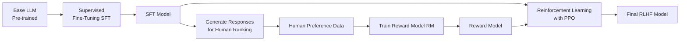
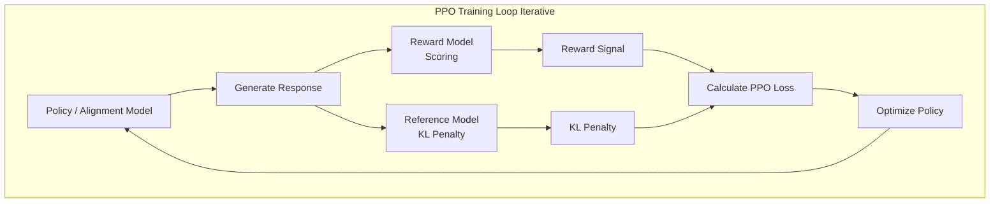

# Paper Notes: Instantly Learning Preference Alignment via In-context DPO, Song et al

## Core Concepts

### Human Preference Alignment

Trained language models can generate accurate results, statistically correct given the training data, but to ensure a model's responses are meeting the expectation of the end user, human preference alignment (HPA) is performed. HPA ensures output is safe and actually helpful to the user.

A common example is that a language model may output technically correct responses but with content that may be harmful, e.g., explosives instructions, sexually suggestive, etc. With HPA the model's output is guided toward more appropriate responses or may decline a potentially harmful request.

The process of HPA is traditionally performed by expensive fine-tuning methods or reinforcement learning from human feedback (RLHF).

### Reinforcement Learning from Human Feedback

The RLHF approach deals with (3) distinct models.

1. The base model (*π₀*), i.e., the LLM we seek to align to human preference, created from supervised fine-tuning (SFT) a raw LLM.
2. A reward model (*r*), a separate neural network we train to score how well LLM responses align to human preference.
3. The *policy* model (*π*), the final optimized model, i.e., copy of the base model, we aim to create.

There are (3) distinct steps in the RHLF method. However, not all steps are exclusive to RLHF.

#### Step 1: Creating the Base Model

Creating the Base Model (π₀) - Starting with a raw LLM, we use training data `{(x₁, y₁), (x₂, y₂), ...}` to conduct supervised fine-tuning; where x = prompt, y = high-quality human response. This is often demonstrated by models that contain a suffix corresponding to their fine-tuning, e.g. Llama-3-8B-Instruct, Qwen1.5-1.8B-Chat, etc. Ultimately, this step creates (π₀) that can follow instructions but isn't necessarily aligned with safety/helpfulness preferences.

#### Step 2: Reward Model

Training the Reward Model - This step creates a reward model (*r*) as a judge to score outputs. We collect human annotated preference data to facilitate the training of this model. The training data here consists of two generated responses `y_A` and `y_B` for each prompt `x` from model π₀. Human labels provide a preference `y_A > y_B`. Essentially, the reward model is trained as a **binary classifier** with a special loss function `Loss = -log(σ(r*(x, y_chosen) - r*(x, y_rejected)))`

#### Step 3: Reinforcement Learning with Proximal Policy Optimization

Proximal Policy Optimization (PPO) is an algorithm for updating the language model's weights during reinforcement learning. The "proximal" part means it keeps updates small to prevent dramatic updates.

The goal of RLHF w/ PPO is to maximize the expected reward from our language model while keeping it from straying too far from sensible outputs of the SFT base model. Mathematically, we're optimizing `T = max_π E[r(x,y) - β·log(π(y|x)/π₀(y|x))]`. This function maximizes the reward *r(x,y)* from our reward model, but penalize the policy model (*π*) if it assigns very different probabilities than the base model (*π₀*). In practice, the base model (*π₀*) remains completely frozen throughout PPO training. It serves as a reference point. We never update its weights. Meanwhile the policy model (*π*) starts as an exact copy of the base model's weights (*π₀*) then gets updated through PPO. The reward model (*r*) doesn't directly update any component of the policy model. Instead, it provides scalar scores that tell PPO which direction to push the policy model's weights.

1. The policy model (*π*) iteratively generates a complete response to prompts.
2. The reward model (*r*) then evaluates each (prompt, response) pair and outputs a single number, e.g., 0.7, indicating how aligned this response is according to human preferences. This score becomes the signal that PPO uses to update the policy model's weights.
3. The **KL regularization** term `β·log(π(y|x)/π₀(y|x))` serves as a anchor. When `π(y|x)` is much larger than `π₀(y|x)`, this term becomes large and positive, creating a penalty. This prevents the model from completely abandoning the language patterns it learned during pre-training and SFT. THe term `β` controls the strength of this anchor. Researchers manually determine `β` through experimentation; too small and the model goes wild chasing rewards, too large and it barely improves from the base model. The function `log(π(y|x)/π₀(y|x))` is where we measure how much the policy (*π*) differs from the base model (*π₀*) in terms of probability ratios. When (*π*) assigns much higher probability than (*π₀*) to some response, the ratio `π/π₀` becomes large, e.g., 10, `log(10) ≈ 2.3`, a positive penalty where subtracting this from the reward discourages this deviation. In contrast, when (*π*) assigns much lower probability than (*π₀*), the ratio `π/π₀` becomes small like 0.1, then `log(0.1) ≈ -2.3`, a negative value that actually helps as subtracting from the reward creates a double negative that becomes positive that creates an addition to the reward.
4. During each update step, we modify all the weights in the policy model (*π*), every attention matrix, every feed-forward layer, every embedding, with the regularized reward value, effectively steering or aligning the model.

Each step requires running all these models, generating from (*π*), scoring with (*r*), comparing against (*π₀*) for the KL penalty, and estimating values for advantage calculation. This computational burden plus the cost of human annotated preferences for training the reward model's binary classifier is why RLHF is so expensive.

### Direct Preference Optimization: A Cheaper Alternative

Instead of the three step RLHF pipeline, i.e, SFT, reward modeling, PPO, Direct Preference Optimization (DPO) collapses this into a single supervised learning objective where preference data (human annotation of "response A > B") contains enough semantic information to directly optimize the policy model without ever explicitly modeling rewards, effectively cutting out an expensive middleman.

**TLDR**; DPO replaces RLHF steps 2 and 3 with a single step, directly train the policy model on preference data without ever creating a reward model, i.e., embed the reward on the transformer's loss function.

DPO rearranges the RLHF equation in a way where the reward model becomes implicit within (*π*) rather than explicit as (*r*).

We start from the RLHF objective, `T = max_π E[r(x,y) - β·log(π(y|x)/π₀(y|x))]`. The KL divergence of this formula in simplified to `max E[r(x,y)] - β · KL(π || π₀)`.

To do this, we seek to replace our reward with a probability distribution. This is achieved with the **Bradley Terry Model**, `P(y_w preferred over y_l | x) = σ(r(x,y_w) - r(x,y_l))` Where *σ* is the sigmoid function, `σ(z) = 1/(1 + e^(-z))` The sigmoid takes any real number and squashes it to a probability between 0 and 1. The Bradley Terry Model is equivalently written as `P(y_w > y_l | x) = exp(r(x,y_w)) / (exp(r(x,y_w)) + exp(r(x,y_l)))`

So we now have the RLHF objective formula, considering it's two parts, reward and KL divergence, and the Bradley Terry Model from which algebraic manipulation is used ot create the DPO loss function.

- `max_π E[r(x,y)` and the reward
- `β·log(π(y|x)/π₀(y|x))` as KL divergence
- `P(y_w > y_l | x) = exp(r(x,y_w)) / (exp(r(x,y_w)) + exp(r(x,y_l)))` for the Bradley Terry Model.

After algebraic manipulation we arrive at the following final **DPO Loss Function.

`L_DPO = -E[(x,y_w,y_l) ~ D] [log σ(β·log(π_θ(y_w|x)/π₀(y_w|x)) - β·log(π_θ(y_l|x)/π₀(y_l|x)))]`

- `π_θ` is our trainable policy
- `σ` is the sigmoid function
- `D` is our dataset of preferences
- `y_w` is our winning response (preferred)
- `y_l` is the losing response
- `E[(x,y_w,y_l) ~ D]` is expect value over dataset average

Once the loss function is calculated per batch, the policy model is updated through standard back propagation, effectively embedding the reward instead of using two separate models.

