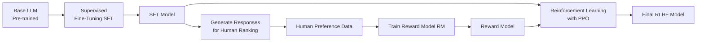
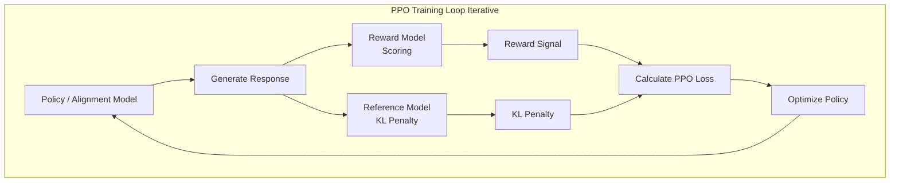

# Paper Review: Instantly Learning Preference Alignment via In-context DPO, Song et al

## Core Concepts

### Human Preference Alignment

Trained language models can generate accurate results, statistically correct given the training data, but to ensure a model's responses are meeting the expectation of the end user, human preference alignment (HPA) is performed. HPA ensures output is safe and actually helpful to the user.

A common example is that a language model may output technically correct responses but with content that may be harmful, e.g., explosives instructions, sexually suggestive, etc. With HPA the model's output is guided toward more appropriate responses or may decline a potentially harmful request.

The process of HPA is traditionally performed by expensive fine-tuning methods or reinforcement learning from human feedback (RLHF).

### Reinforcement Learning from Human Feedback

The RLHF approach deals with (3) distinct models.

1. The base model (*π₀*), i.e., the LLM we seek to align to human preference, created from supervised fine-tuning (SFT) a raw LLM.
2. A reward model (*r*), a separate neural network we train to score how well LLM responses align to human preference.
3. The *policy* model (*π*), the final optimized model, i.e., copy of the base model, we aim to create.

There are (3) distinct steps in the RHLF method. However, not all steps are exclusive to RLHF.

**Step 1**: Creating the Base Model (π₀) - Starting with a raw LLM, we use training data `{(x₁, y₁), (x₂, y₂), ...}` to conduct supervised fine-tuning; where x = prompt, y = high-quality human response. This is often demonstrated by models that contain a suffix corresponding to their fine-tuning, e.g. Llama-3-8B-Instruct, Qwen1.5-1.8B-Chat, etc. Ultimately, this step creates (π₀) that can follow instructions but isn't necessarily aligned with safety/helpfulness preferences.

**Step 2**: Training the Reward Model - This step creates a reward model (*r*) as a judge to score outputs. We collect human annotated preference data to facilitate the training of this model. The training data here consists of two generated responses `y_A` and `y_B` for each prompt `x` from model π₀. Human labels provide a preference `y_A > y_B`. Essentially, the reward model is trained as a **binary classifier** with a special loss function `Loss = -log(σ(r*(x, y_chosen) - r*(x, y_rejected)))`

**Step 3**:

