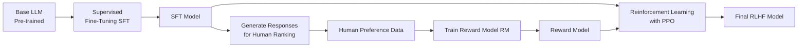
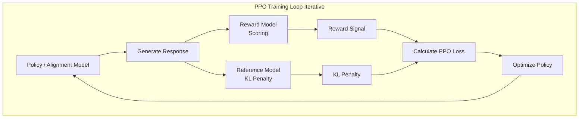
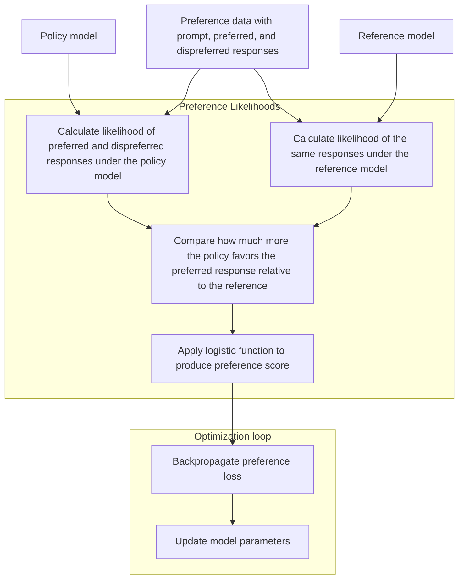
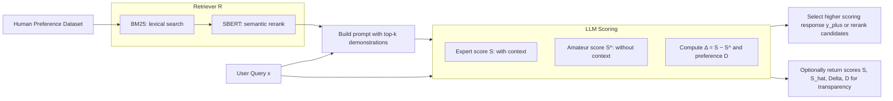

# Paper Notes: Instantly Learning Preference Alignment via In-context DPO, Song et al

## Core Concepts

### Human Preference Alignment

Trained language models can generate accurate results, statistically correct given the training data, but to ensure a model's responses are meeting the expectation of the end user, human preference alignment (HPA) is performed. HPA ensures output is safe and actually helpful to the user.

A common example is that a language model may output technically correct responses but with content that may be harmful, e.g., explosives instructions, sexually suggestive, etc. With HPA the model's output is guided toward more appropriate responses or may decline a potentially harmful request.

The process of HPA is traditionally performed by expensive fine-tuning methods or reinforcement learning from human feedback (RLHF).

### Reinforcement Learning from Human Feedback

The RLHF approach deals with (3) distinct models.

1. The base model (*π₀*), i.e., the LLM we seek to align to human preference, created from supervised fine-tuning (SFT) a raw LLM.
2. A reward model (*r*), a separate neural network we train to score how well LLM responses align to human preference.
3. The *policy* model (*π*), the final optimized model, i.e., copy of the base model, we aim to create.

There are (3) distinct steps in the RHLF method. However, not all steps are exclusive to RLHF.



#### Step 1: Creating the Base Model

Creating the Base Model (π₀) - Starting with a raw LLM, we use training data `{(x₁, y₁), (x₂, y₂), ...}` to conduct supervised fine-tuning; where x = prompt, y = high-quality human response. This is often demonstrated by models that contain a suffix corresponding to their fine-tuning, e.g. Llama-3-8B-Instruct, Qwen1.5-1.8B-Chat, etc. Ultimately, this step creates (π₀) that can follow instructions but isn't necessarily aligned with safety/helpfulness preferences.

#### Step 2: Reward Model

Training the Reward Model - This step creates a reward model (*r*) as a judge to score outputs. We collect human annotated preference data to facilitate the training of this model. The training data here consists of two generated responses `y_A` and `y_B` for each prompt `x` from model π₀. Human labels provide a preference `y_A > y_B`. Essentially, the reward model is trained as a **binary classifier** with a special loss function `Loss = -log(σ(r*(x, y_chosen) - r*(x, y_rejected)))`

#### Step 3: Reinforcement Learning with Proximal Policy Optimization

Proximal Policy Optimization (PPO) is an algorithm for updating the language model's weights during reinforcement learning. The "proximal" part means it keeps updates small to prevent dramatic updates.

The goal of RLHF w/ PPO is to maximize the expected reward from our language model while keeping it from straying too far from sensible outputs of the SFT base model. Mathematically, we're optimizing `T = max_π E[r(x,y) - β·log(π(y|x)/π₀(y|x))]`. This function maximizes the reward *r(x,y)* from our reward model, but penalize the policy model (*π*) if it assigns very different probabilities than the base model (*π₀*). In practice, the base model (*π₀*) remains completely frozen throughout PPO training. It serves as a reference point. We never update its weights. Meanwhile the policy model (*π*) starts as an exact copy of the base model's weights (*π₀*) then gets updated through PPO. The reward model (*r*) doesn't directly update any component of the policy model. Instead, it provides scalar scores that tell PPO which direction to push the policy model's weights.

1. The policy model (*π*) iteratively generates a complete response to prompts.
2. The reward model (*r*) then evaluates each (prompt, response) pair and outputs a single number, e.g., 0.7, indicating how aligned this response is according to human preferences. This score becomes the signal that PPO uses to update the policy model's weights.
3. The **KL regularization** term `β·log(π(y|x)/π₀(y|x))` serves as a anchor. When `π(y|x)` is much larger than `π₀(y|x)`, this term becomes large and positive, creating a penalty. This prevents the model from completely abandoning the language patterns it learned during pre-training and SFT. THe term `β` controls the strength of this anchor. Researchers manually determine `β` through experimentation; too small and the model goes wild chasing rewards, too large and it barely improves from the base model. The function `log(π(y|x)/π₀(y|x))` is where we measure how much the policy (*π*) differs from the base model (*π₀*) in terms of probability ratios. When (*π*) assigns much higher probability than (*π₀*) to some response, the ratio `π/π₀` becomes large, e.g., 10, `log(10) ≈ 2.3`, a positive penalty where subtracting this from the reward discourages this deviation. In contrast, when (*π*) assigns much lower probability than (*π₀*), the ratio `π/π₀` becomes small like 0.1, then `log(0.1) ≈ -2.3`, a negative value that actually helps as subtracting from the reward creates a double negative that becomes positive that creates an addition to the reward.
4. During each update step, we modify all the weights in the policy model (*π*), every attention matrix, every feed-forward layer, every embedding, with the regularized reward value, effectively steering or aligning the model.



Each step requires running all these models, generating from (*π*), scoring with (*r*), comparing against (*π₀*) for the KL penalty, and estimating values for advantage calculation. This computational burden plus the cost of human annotated preferences for training the reward model's binary classifier is why RLHF is so expensive.

### Direct Preference Optimization: A Cheaper Alternative

Instead of the three step RLHF pipeline, i.e, SFT, reward modeling, PPO, Direct Preference Optimization (DPO) collapses this into a single supervised learning objective where preference data (human annotation of "response A > B") contains enough semantic information to directly optimize the policy model without ever explicitly modeling rewards, effectively cutting out an expensive middleman.

**TLDR**; DPO replaces RLHF steps 2 and 3 with a single step, directly train the policy model on preference data without ever creating a reward model, i.e., embed the reward on the transformer's loss function.

DPO rearranges the RLHF equation in a way where the reward model becomes implicit within (*π*) rather than explicit as (*r*).

We start from the RLHF objective, `T = max_π E[r(x,y) - β·log(π(y|x)/π₀(y|x))]`. The KL divergence of this formula in simplified to `max E[r(x,y)] - β · KL(π || π₀)`.

To do this, we seek to replace our reward with a probability distribution. This is achieved with the **Bradley Terry Model**, `P(y_w preferred over y_l | x) = σ(r(x,y_w) - r(x,y_l))` Where *σ* is the sigmoid function, `σ(z) = 1/(1 + e^(-z))` The sigmoid takes any real number and squashes it to a probability between 0 and 1. The Bradley Terry Model is equivalently written as `P(y_w > y_l | x) = exp(r(x,y_w)) / (exp(r(x,y_w)) + exp(r(x,y_l)))`

So we now have the RLHF objective formula, considering it's two parts, reward and KL divergence, and the Bradley Terry Model from which algebraic manipulation is used ot create the DPO loss function.

- `max_π E[r(x,y)` and the reward
- `β·log(π(y|x)/π₀(y|x))` as KL divergence
- `P(y_w > y_l | x) = exp(r(x,y_w)) / (exp(r(x,y_w)) + exp(r(x,y_l)))` for the Bradley Terry Model.

After algebraic manipulation we arrive at the following final **DPO Loss Function.

`L_DPO = -E[(x,y_w,y_l) ~ D] [log σ(β·log(π_θ(y_w|x)/π₀(y_w|x)) - β·log(π_θ(y_l|x)/π₀(y_l|x)))]`

- `π_θ` is our trainable policy
- `σ` is the sigmoid function
- `D` is our dataset of preferences
- `y_w` is our winning response (preferred)
- `y_l` is the losing response
- `E[(x,y_w,y_l) ~ D]` is expect value over dataset average

Once the loss function is calculated per batch, the policy model is updated through standard back propagation, effectively embedding the reward instead of using two separate models.



### In-Context Learning (ICL) Fundamentals

In-Context Learning is the ability of large language models to learn a behavior from examples provided in the prompt itself, without updating their parameters.
For instance:

```plainttext
Prompt: Translate English to French:
cat - chat
dog - chien
tree - arbre
house -
```

```
Output
“maison”
```

The model effectively learned a translation rule in context. It’s not performing gradient updates; it’s exploiting the statistical structure of the examples and its prior training to infer the mapping. In HPA, we can guide an LLM toward desired behaviors without retraining it; just by prompt design.

## Instantly Learning Preference Alignment via In-context DPO

This paper introduces **In-Context Direct Preference Optimization (ICDPO)**, which combines in-context learning with DPO principles to achieve alignment **without fine-tuning**.

### Core Ideas

#### Motivations

The authors ask *"Can we perform DPO-like optimization without training, by just conditioning the base model appropriately?"* Direct Preference Optimization (DPO) is already a simplification of RLHF that removes the need for reinforcement learning by directly optimizing for preference, but it still requires fine-tuning, which leaves the following drawbacks.

- Parameter updates / training cost
- Storage of fine-tuned models / checkpoints
- Possible over-fitting to small preference datasets.

ICDPO replicates the logic of DPO inside a prompt, letting the base model reason as if it were DPO-trained.

#### High Level Methods

ICDPO has two conceptual layers.

1. The retriever - Given a new query *x*, the system retrieves a few demonstrations, i.e., previously seen examples of prompts, good responses, and their comparisons that act as in-context training / preference data.
2. The contrastive inference - The model sees the demonstrations and two candidate responses `y+(preferred) and y−(dispreferred)`. It uses its own internal scoring (via log probabilities) to decide which one aligns better with the expert pattern represented in the retrieved context.

#### Contrastive Inference vs. DPO

ICDPO replaces training-time ratios (KL Regularization) with in-context ratios, computed over the model’s log-probabilities given demonstrations. In other words, the model generations of tokens is conditioned on demonstrations in-context.

We call this in-context ratio the **expert score**, `S(x,y)=log π(y∣x,D_context​)` allowing the model to map the relationships between positive demonstrations (preferred) versus negative demonstrations, `S(x,y+)−S(x,y−)`.

#### Expert Amateur Collaboration Intro

The authors describe ICDPO as an expert–amateur dynamic where the expert is a simulated DPO-tuned model instantiated with demonstrations in-context while the amateur is the base model responding to the query with no demonstrations in-context. The model collaborates between where ICDPO turns a prompt into a pseudo fine-tuning session.

### Expert–Amateur Collaboration and Scoring

The **amateur** is the base model: it can answer any prompt, but it hasn’t been fine-tuned for alignment.

The **expert** is a simulated DPO-trained model, not a separate network, but a persona created in-context by providing preference demonstrations.

When the model receives a query, it behaves as if the expert (represented by retrieved demonstrations) is supervising its reasoning, while the amateur produces candidate answers.

#### Scoring

1. Expert score `S(x,y)` - The log-probability of response *y* when the model is conditioned on expert demonstrations (the retrieved context).
2. Amateur score `S^(x,y)` - The log-probability of the same response when no demonstrations are provided (the bare model).

These two are compared for a given pair of responses `(y+,y−)`. If the expert-context raises the likelihood of *y+* more than *y−*, the model infers that *y+* aligns better with the expert preference pattern. Thus, alignment is enacted as a contrast between conditioned and unconditioned likelihoods.

#### Collaboration (contrastive) Signal

The “expert guidance” is the improvement that the expert context provides, `Δ(x,y)=S(x,y)−S^(x,y)`. This difference quantifies how much the context made the model favor this response.

Then for a preferred vs dis-preferred pair, the final comparison is `D(x)=Δ(x,y+)−Δ(x,y−)`.

#### Technical Implementation



1. Retrieval Mechanism

    ```plaintext
    for each input X do;
        get N candidate demonstrations # BM25
        semantic rank demonstrations # SBERT
        return top-k demonstrations
    ```

2. Prompt Construction

    ```plaintext
    # Demonstration 1
    Prompt: Explain why exercise is important.
    Preferred: It improves health and mood.
    Dispreferred: Exercise is boring.

    # Demonstration 2
    Prompt: Describe a cat.
    Preferred: A small, playful animal often kept as a pet.
    Dispreferred: Cats are annoying.

    # New Query
    Prompt: What are benefits of reading books?
    Candidate Response: # y
    ```

3. Scoring (condition -> score -> compare -> choose)

- Compute Expert Score `S(x,y)` via `log π(y∣x,D_expert​)`, i.e., summing log_softmax token probabilities for all tokens in *y*.
- Compute Amateur score `S^(x,y)` passing only *Prompt: x* to generate candidate Response *y*, and compute log-probability `log π(y∣x,D_expert​)`.
- Contrastive step subtracts `Δ(x,y)=S−S^` then evaluates preference difference *D(x)*. This process is **inference only**, no back-propagation, no parameter update. It just reads token likelihoods from the model’s forward pass.
- Decide or weigh responses, select the higher-scoring response (alignment filter), or weight candidate responses by *D(x)* for re-ranking or generation.

### Two-stage retriever *R* (BM25 to SBERT)

ICDPO’s alignment quality depends entirely on the demonstrations placed in context. Retriever *R* selects those examples from the preference dataset so that the model sees relevant, high-quality expert behavior for each new query *x*.

1. **BM25** Lexical Filtering - Uses classic term-frequency / inverse document frequency (TF-IDF) scoring to quickly narrow thousands of demonstrations to a small subset that share keywords with the new prompt. This enables fast and cheap retrieval and may miss semantic matches but it guarantees topical overlap.

2. **SBERT** Semantic Re-ranking - Encodes both the query *x* and each BM25-retrieved demonstration into sentence embeddings using a Sentence-BERT model. It then computes cosine similarity between embeddings and promote demos that are semantically similar, not just lexically similar. It then returns top-k demonstrations with the highest similarity scores.

This hybrid design gives speed with BM25 and accuracy with SBERT while avoiding the cost of embedding the entire corpus each time.

### Experiments and Empirical Findings for ICDPO vs DPO

#### Experiment Set-up

**Datasets (human preference datasets):**

1. **HH-RLHF (Anthropic Helpful–Harmless)**
    - Human-labeled comparisons of helpful vs. harmless responses.
    - Used to test how well models align with *safety* and *helpfulness* goals.
    - Evaluated both by a learned reward model (RM) and GPT-4 as a judge.

2. **AlpacaEval (Li et al., 2023b)**
    - GPT-4–based benchmark for *instruction-following* ability.
    - Uses automatic pairwise comparisons (win/tie/lose) between model outputs and reference answers.
    - Includes length-bias correction so longer answers aren’t unfairly rewarded.

---

Models:

- **LLaMA-7B, LLaMA-2-7B, Mistral-7B-v0.1**
- Representative open-weight models with different base capabilities.
- Serve as frozen backbones for testing how well ICDPO generalizes across architectures.

---

Baselines (tuning-free or prompt-based methods):

- **Zero-Shot** — base model responses with no alignment or context.
- **RM-BoN (Best-of-N)** — generates several completions and picks the one with the *highest reward model score*.
- **RM-Aug** — incorporates reward signals during decoding (biases token probabilities using the reward model).
- **URIAL** — prompt-based ICL alignment; uses retrieved examples of good behavior as in-context demonstrations.
- **RAIN** — self-evaluative prompting; the model critiques and refines its own responses (no external retriever).

➡ These baselines **do not modify model weights** — they rely solely on *prompt-level* or *decoding-level* adaptation.

---

Fine-tuning baselines (trainable methods):

- **SFT (Supervised Fine-tuning)** — standard supervised training on preferred responses.
- **DPO (Direct Preference Optimization)** — fine-tunes using preference pairs without a reward model.
- **ICDPO (In-context DPO)** — proposed *tuning-free* variant; simulates DPO via in-context examples and log-prob comparisons.

➡ These involve (SFT, DPO) *updating parameters* except ICDPO, which is *inference-only.*

---

**Evaluation Metrics:**
- **RMtest score**
  - Score assigned by a trained reward model.
  - Measures how “aligned” or “human-preferred” outputs are.
  - Higher = better alignment quality.
- **GPT-4 Win/Tie/Lose rate**
  - GPT-4 acts as a human judge comparing model vs. reference answers.
  - Tests *perceived helpfulness and correctness*.
- **Length-Controlled Win Rate (AlpacaEval)**
  - Removes length bias in GPT-4 judging.
  - Tests instruction-following ability more objectively.
- **Mean Reciprocal Rank (MRR)**
  - Correlates ICDPO preference scores with GPT-4 ranking.
  - Measures *consistency* between ICDPO’s internal scoring and external evaluation.

---

#### Results

##### RM Evaluations

(*Quantitative comparison of alignment scores via reward model.*)

| Method                               | LLaMA  | LLaMA-2 | Mistral |
| ------------------------------------ | ------ | ------- | ------- |
| Zero-Shot                            | −36.54 | −30.72  | −11.82  |
| RM-BoN                               | −31.04 | −22.82  | 0.52    |
| RM-Aug                               | −27.66 | −24.61  | 3.32    |
| **ICDPO**                            | 25.56  | 62.27   | 68.81   |
| **ICDPO + Ŝ**                        | 28.48  | 63.69   | 71.16   |
| **ICDPO + ŜR (two-stage retriever)** | 51.56  | 69.66   | 73.59   |

💡 *ICDPO and its variants outperform RM-based and prompt baselines by large margins, matching fine-tuned DPO accuracy.*

---

##### GPT-4 Evaluations

(*External human-like judgment via GPT-4 on 200 HH-RLHF samples.*)

- ICDPO variants consistently achieve higher combined **win + tie** rates.
- Validates that ICDPO’s internal scoring aligns with human-like preference judgments.
- *Helpful* subset harder (open-ended reasoning) than *Harmless* subset (safety adherence).

---

##### AlpacaEval Results

(*Automatic GPT-4 comparison on instruction-following tasks.*)

| Base    | RM-BoN | RM-Aug | URIAL | RAIN  | **ICDPO**         | **ICDPO + Ŝ**     |
| ------- | ------ | ------ | ----- | ----- | ----------------- | ----------------- |
| LLaMA   | 1.58   | 2.29   | 5.38  | 6.81  | **10.00 (+3.19)** | **10.26 (+3.45)** |
| LLaMA-2 | 6.31   | 6.20   | 6.95  | 16.27 | **18.66 (+2.39)** | **19.24 (+2.97)** |
| Mistral | 17.14  | 18.51  | 21.90 | 26.32 | **26.53 (+0.21)** | **28.30 (+1.98)** |

ICDPO + *S^* consistently wins across all base models and benchmarks — especially strong gains on weaker backbones like LLaMA.

- Baselines rely on reward models or prompt tricks; **ICDPO** achieves alignment without either.
- Fine-tuning baselines modify model weights; ICDPO mimics fine-tuning effects dynamically.
- Evaluations progressively measure: internal reward alignment → GPT-4 human-likeness → task generalization.
- Across all, **ICDPO + two-stage retriever (S^, R)** delivers the highest or near-highest alignment with minimal compute cost.

##### Fine-tuning Comparisons

| Method              | LLaMA     | LLaMA-2   | Mistral   |
| ------------------- | --------- | --------- | --------- |
| SFT                 | 34.73     | 57.59     | 63.43     |
| DPO                 | 43.02     | 68.34     | 69.26     |
| CPO-SimPO           | 45.80     | 58.41     | 73.07     |
| **ICDPO (2 demos)** | 25.56     | 62.27     | 68.81     |
| **ICDPO + ŜR**      | **51.56** | **69.66** | **73.59** |

#### Ablation Findings

- Removing the SBERT re-ranker drops performance notably, indicating semantic retrieval is crucial.
- Using random demonstrations collapses results to near-SFT levels, demonstrating relevance of context is key.
- Increasing demo count beyond ~5 gives diminishing returns showing a optimal few-shot window exists.

## References

* [Instantly Learning Preference Alignment via In-context DPO](https://aclanthology.org/2025.naacl-long.8/) (Song et al., NAACL 2025)
