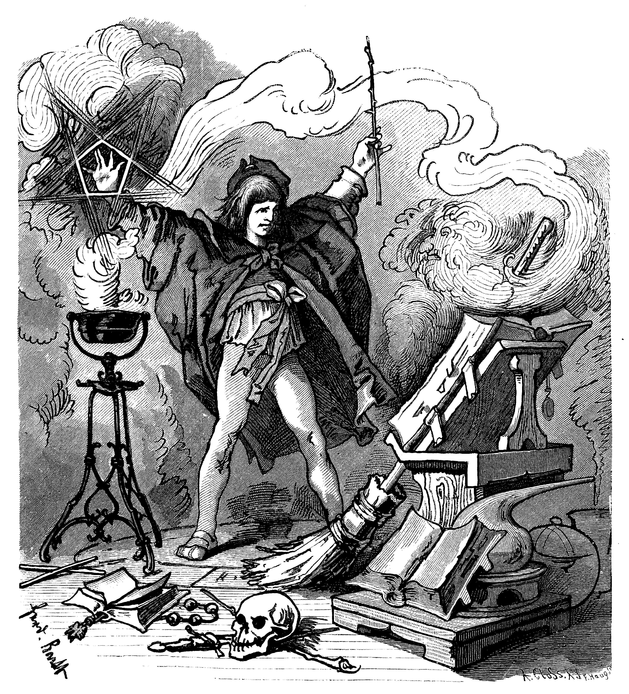
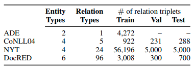
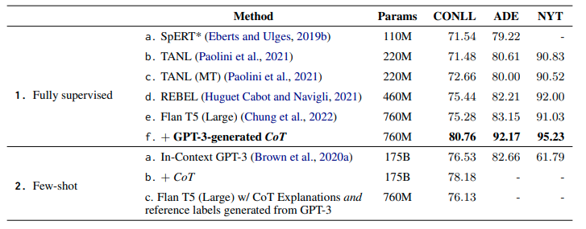

# Paper Review

### Revisiting Relation Extraction in the Era of Large Language Models

Jason Gillette



---
# Revisiting Relation Extraction in the Era of Large Language Models

**Authors**: Somin Wadhwa, Silvio Amir, Byron C. Wallace
**Institution**: Northeastern University
**Published**: July 2023, 61st Annual Meeting of the Association for Computational Linguistics (ACL)

---

# Introduction to Relation Extraction

- **What is Relation Extraction (RE)?**
  - Core NLP task of identifying relationships between entities within text.
  - Traditional RE methods rely on supervised learning to tag entities and classify relationships.

```plaintext
Input Text: "Steve Jobs founded Apple Computers."
Output Triplet: ("Apple Computers", "<founded_by>", "Steve Jobs")
```

---

# Introduction to Relation Extraction (cont'd)

- **Challenges and Recent Advances**
  - Supervised models require extensive labeled data, limiting scalability.
  - Emerging generative approaches suggest potential for RE with less data, using large language models (LLMs).

```plaintext
Extract the relationship between entities in the following sentences.
Return the output in the format: (Entity 1, Relationship, Entity 2).

Example:
Input: "Barack Obama was born in Honolulu."
Output: ("Barack Obama", "Born In", "Honolulu")

Input: "Marie Curie discovered radium in 1898."
Output:
```

---

# Opening Analysis of the Paper’s Objectives

- **Primary Goals**
  - Evaluate LLMs' capabilities in RE with minimal labeled data.
  - Compare GPT-3 and Flan-T5 across supervised, few-shot, and fine-tuned approaches.
  - Address the challenges of evaluating generative models in RE, including variability in output format.

---

# Opening Analysis of the Paper’s Objectives (cont'd)

- **Research Questions**
  - Can LLMS (GPT-3, Flan T5) achieve RE performance comparable to traditional supervised models with few-shot learning?
  - How can CoT explanations improve RE in Flan-T5 to reach state-of-the-art (SOTA) results?
  - How can evaluation of generative LLM outputs be performed in RE tasks?

---

# Methods and Experimental Design

- **Models Used**
  - **GPT-3**: Tested in a few-shot learning context, using limited examples in prompts.
  - **Flan-T5**: Evaluated in both few-shot and fine-tuning settings, with CoT explanations as a supervised enhancement.

---

# Methods and Experimental Design (cont'd)

- **Chain-of-Thought (CoT) Explanations**
  - GPT-3 was used to generate CoT explanations to improve RE Flan-T5.
  - This method involves generating rationales for each relation extraction, allowing the model to learn reasoning paths.

```plaintext
Example Input (NYT) It will be the final movie credited to Debra Hill, a film producer \ 
and native of Haddonfield, who produced “Halloween” and was considered a pioneering woman in film.
Target [[Debra Hill:Per, place-of-birth, Haddonfield:Loc]]
Explanation - Debra Hill was a film producer born (native of) in Haddonfield.
```

---

# Methods and Experimental Design (cont'd)

- **Datasets and Evaluation**
  - Datasets: ADE, CoNLL, NYT, DocRED (covering a range of entity and relation types).
  - **Prompting Strategy**: Each model used structured prompts specific to each dataset.
  - **Human Annotation**: Used to handle evaluation challenges with generative outputs, allowing for non-exact matches.
    (see next slide)

  

---

# Evaluation Shortfalls

```plaintext
Out-of-Domain (CoNLL04)
In 1881 , President James A. Garfield was shot by Charles J.
Guiteau, a disappointed office-seeker, at the Washington
railroad station.
Reference
[('Charles J. Guiteau', 'Kill', 'President James A. Garfield')]
Generated
[(‘James A. Garfield', 'Shot_By', 'Charles J. Guiteau')]
```

Correct, but counted as false positive.

---

# Evaluation Shortfalls

```plaintext
On Friday, U.S. Ambassador Vernon A. Walters displayed
photographs of one Libyan jet showing shapes resembling
missile pods on its wings and fuselage.
Reference
[(‘Vernon A. Walters', 'Live_In', ‘U.S.’)]
Generated
[(‘Amb. Vernon A. Walters', 'Work_For', ‘U.S’)]
```

Correct, but counted as false positive.

---

# Key Findings

- **Few-Shot Performance of GPT-3**
  - GPT-3 achieved near-SOTA performance with minimal labeled data (10-20 examples), highlighting the power of in-context learning.
  - Human evaluation revealed many “false positives” were actually correct, underscoring the need for flexible evaluation metrics.

  

---

# Key Findings (cont'd)

- **Improved RE with Flan-T5 and CoT Explanations**
  - Fine-tuning Flan-T5 with CoT explanations generated by GPT-3 led to SOTA results across datasets.
  - CoT explanations helped to standardize model outputs and reduced errors, particularly in cases with complex relations.

---

# Key Findings (cont'd)

- **Performance Metrics and Evaluation Insights**
  - The authors provide metrics (precision, recall, F1 score) and analysis of evaluation challenges, showing that strict exact-matching is often overly restrictive for RE.

---

# Discussion

- **Implications for Relation Extraction Using LLMs**
  - LLMs can reduce the need for large, labeled datasets, which is beneficial for scalability and adaptability.
  - Few-shot learning demonstrates the potential of LLMs as a default RE approach in low-data environments.

---

# Discussion (cont'd)

- **Strengths and Weaknesses**
  - Strengths: 
    - Efficient, high-performance RE with minimal data requirements.
    - Generative LLMs demo more flexibility than traditional token classification in RE, potentially reducing costs.
  - Weaknesses: 
    - High costs and prompt sensitivity with large models like GPT-3; limited application in datasets with many relation types.

---

# Future Directions

- **Automating Evaluation for Generative RE Models**
  - The authors suggest future work on automating evaluation to replace manual annotation.
- **Exploring Broader Applications and Additional Languages**
  - Future studies could extend this approach to non-English datasets and explore RE in specialized domains.

---

# Conclusion

- **Summary of Contributions**
  - Demonstrates that LLMs like GPT-3 and Flan-T5 can achieve high performance in RE tasks with few-shot and fine-tuning methods.
  - Shows that CoT explanations generated by GPT-3 can further enhance performance when used to fine-tune smaller, open-source models like Flan-T5.

---

# Questions

1. Can we use a distance metric to better evaluate or normalize generated relations?
2. What is the latency and relative expense of generating CoT prompts versus traditional annotation?

[Revisiting Relation Extraction in the era of Large Language Models](https://aclanthology.org/2023.acl-long.868) (Wadhwa et al., ACL 2023)