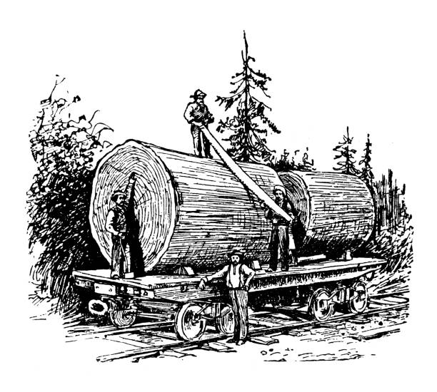
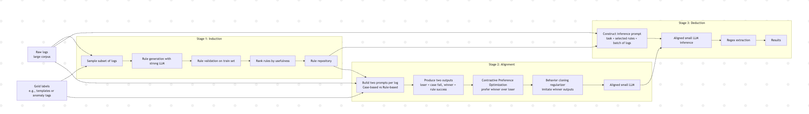
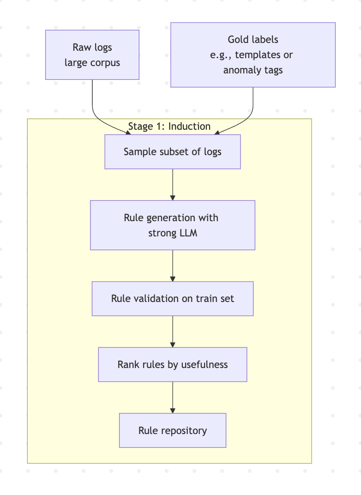
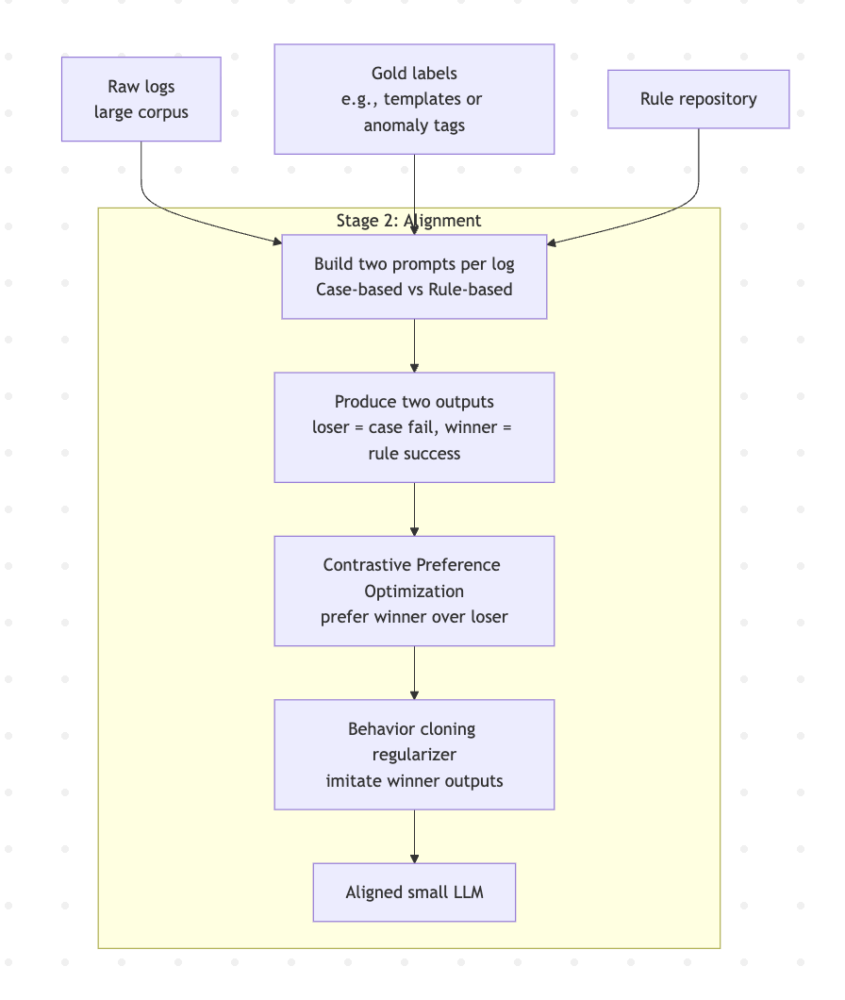
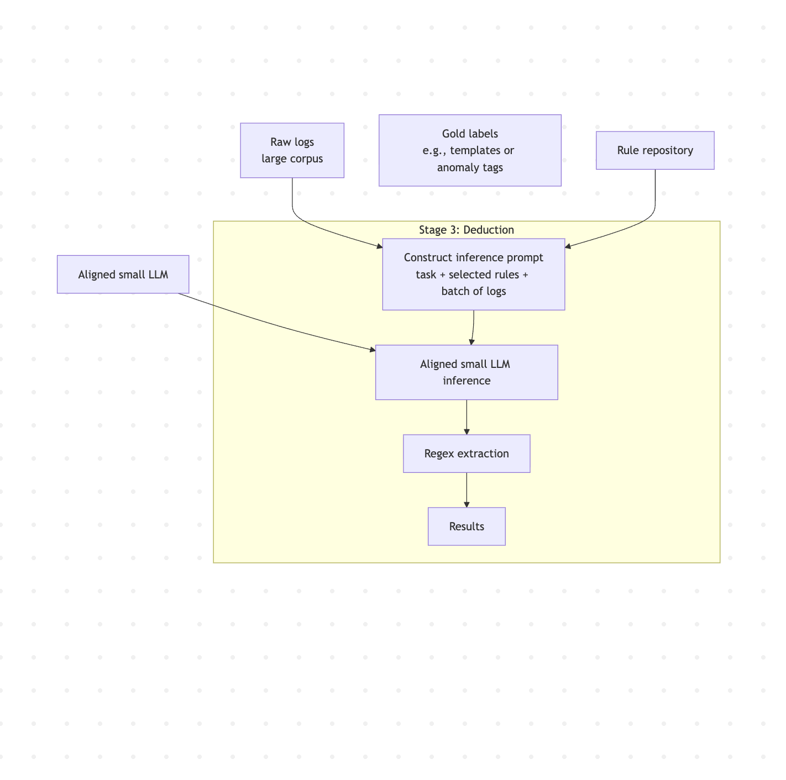
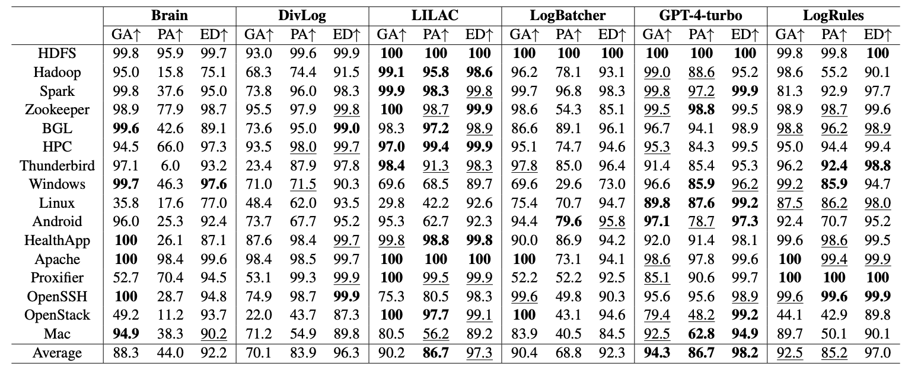
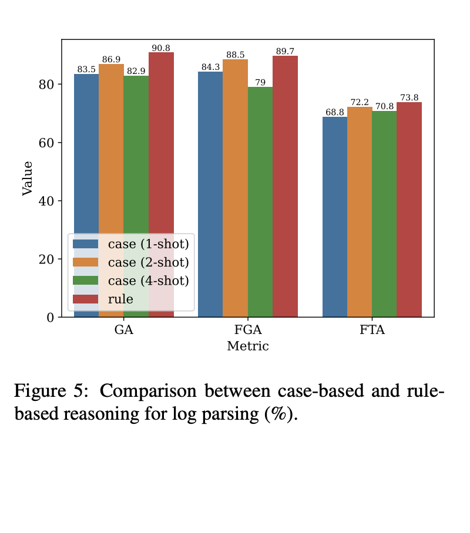
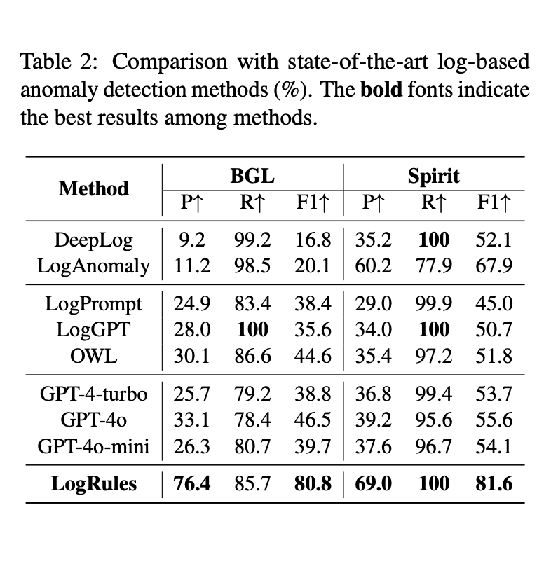
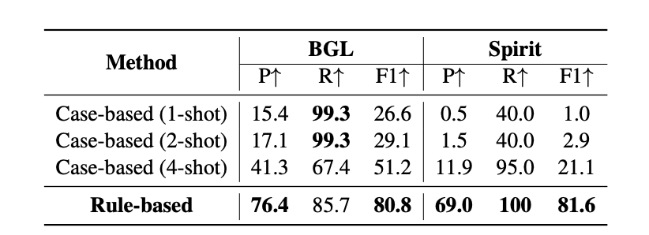
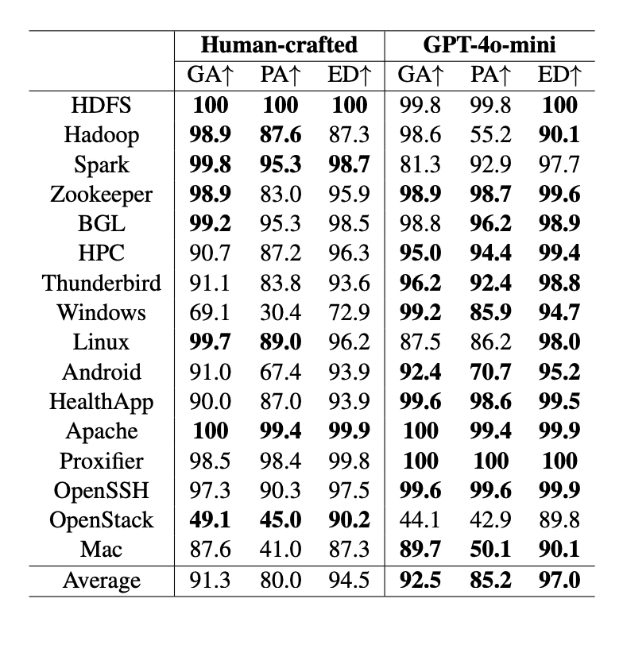

<!-- title slide with split layout and background image -->

# LogRules: Enhancing Log Analysis Capability of Large Language Models through Rules

Presented by Jason Gillette

University of Texas at San Antonio

September 15th, 2025



---

## Introduction

**Paper**: *LogRules: Enhancing Log Analysis Capability of Large Language Models
through Rules*
**Authors**: Xin Huang (Beijing Institute of Technology), Ting Zhang (Peking University), Wen Zhao (Peking University)
**Problem Statement**: "*smaller LLMs often lack the rule comprehension necessary to solve log tasks correctly or fail to follow the rules properly*" - large models can use rules but are costly, while small models are cheaper but fail to follow rules consistently.

<!-- problem statement not explicitly stated in manuscript -->
---

## Background

### What is logging?

- the activity of felling trees and cutting and preparing the timber. :wood:
- the process of recording event messages generated by systems :page_facing_up:

### What is log parsing?

Log parsing is the conversion of raw logs to templates + parameters, e.g., `reading data from /etc/data` to template `reading data from <*>` and parameter `/etc/data`.

### What is anomaly detection?

- Identifying log entries that deviate from normal system behavior, signaling a failure, misconfiguration, or security issue.
- Parsing enables signal (parameters), preventing noise from log constants (templates).

---

## Background (cont.)

### Why is parsing so difficult?

- Traditional REGEX extraction is brittle and fails to generalize as logs evolve.
- Case-based parsing (few-shot) tends to memorize examples, also doesn't generalize.

### What is case-based parsing versus rule-based parsing?

- Case-based parsing: A model is given a few examples of logs and their templates, then asked to parse new logs by analogy.
- Rule-based parsing: The model is given explicit rules for how to abstract variables, then asked to apply them.

---

## Background (cont..)

### Case-based Prompt

```plaintext
Example: Jetty bound to port 62267 → Jetty bound to port <*>
Example: Got allocated containers 1 → Got allocated containers <*>
Now parse: Jetty bound to port 50322
```

### Rule-based Prompt

```plaintext
Rules:
1. Replace numbers with <*>
2. Replace file paths with <*>
Log: Jetty bound to port 50322
```

```plaintext
Response: Jetty bound to port <*>
```

---

## Architecture

1. Induction - Use strong LLM (GPT-4o-mini) for rule discovery
2. Alignment - Align smaller (cheaper) LLM (~7–8B) to prefer rules (fine-tuning)
3. Deduction - Generate results using fixed rule repository



---

## Induction

- **Input**: sampled training logs
- **Rule generation**: GPT model proposes candidate rules, e.g., replace numbers, replace paths, replace ports
- **Validation**: keep only rules that consistently parse correctly
- **Ranking**: Rank occurrence in training set
- **Output**: rule repository



---

### Rule-base Sample

| Rank | Rule description |
| ---: | ---------------- |
|    1 | Replace sequences of numbers with `{{variable}}`                                                            |
|    2 | Replace IP addresses with `{{variable}}`                                                                    |
|    3 | Replace host names with `{{variable}}`                                                                      |
|    4 | Replace any occurrence of `size <number>` with `size {{variable}}`                                          |
|    5 | Replace any occurrence of `blk_<number>` with `{{variable}}`                                                |
|    6 | Replace any sequence indicating a user with `user={{variable}}`                                             |
|    7 | Replace any `uid=<number>` and `euid=<number>` with `uid={{variable}}` and `euid={{variable}}` respectively |

---

## Alignment / Fine-tuning

- **Challenge**: small LLMs don’t naturally follow rules
- **Dual prompting**:
    Case-based prompt → wrong output
    Rule-based prompt → correct output
- **Training pairs**: (log, gold, loser, winner)
- **Contrastive Preference Optimization (CPO)**: Increase winner probability, push down loser
- **Behavior cloning**: keeps outputs stable & on-task



---

## Deduction

- **Testing workflow**: Prompt = {task + rules + logs} (Batching logs to avoid one-by-one bottleneck)
- Small aligned LLM outputs templates or anomaly labels
- Regex extracts final results

:memo: No new rules are induced during tested, all inherited from induction.



---

## Experiment

### Research Question

Can explicit rules + a small aligned LLM (~7–8B) **parse logs** and **detect anomalies** better than case-based prompting and prior large LLM parsers—especially on unseen data.

### Tasks & datasets

- **Log parsing**: 16 [Loghub datasets](https://github.com/logpai/loghub/tree/master), 2k logs each. Training uses **one log** from each of 10 datasets (for induction + alignment); testing uses the remaining 6 datasets (unseen systems/templates).

input: `workerEnv.init() ok /etc/httpd/conf/workers2.properties` + rule-base
output: `workerEnv.init() ok <*>`

- **Anomaly detection**: BGL and Spirit, 10,000 logs each, 4:1 train/test split, no overlap.

---

## Loghub Data Sample

```json
{
  "log_samples": [
    {
      "line_id": 1,
      "timestamp": "Sun Dec 04 04:47:44 2005",
      "level": "notice",
      "content": "workerEnv.init() ok /etc/httpd/conf/workers2.properties",
      "event_id": "E2",
      "event_template": "workerEnv.init() ok <*>"
    },
    {
      "line_id": 2,
      "timestamp": "Sun Dec 04 04:47:44 2005",
      "level": "error",
      "content": "mod_jk child workerEnv in error state 6",
      "event_id": "E3",
      "event_template": "mod_jk child workerEnv in error state <*>"
    }
  ]
}
```

---

## LogRules Models & Baseline Models

### LogRules

- Induction: GPT-4o-mini to generate and rank rules.
- Alignment + Deduction: Qwen2.5-7B-Instruct, LLaMA-3-8B, LLaMA-3.1-8B

### Baselines

- Parsing: Brain, DivLog, LILAC, LogBatcher (case-based LLaMA-3-8B), GPT-4-turbo.
- Anomaly detection: DeepLog, LogAnomaly, LogPrompt, LogGPT, OWL, plus OpenAI GPT models.

---

### Log Parsing Metrics

- Grouping Accuracy (GA) - Whether logs of same template predicted in same cluster.
- Parsing Accuracy (PA) - Exact match between predicted template and gold template.
- Normalized Edit Distance (ED) - How similar predicted template is to gold, in terms of edit operations, normalized for length.
- F1 score of Grouping Accuracy (FGA) - Precision/Recall trade-off on grouping.
- F1 score of Template Accuracy (FTA) - Precision/Recall on exact template matches.

### Anomaly Detection Metrics

- Precision (P) - Of the logs predicted anomalous, how many really are?
- Recall (R) - Of all real anomalies, how many did the model catch?
- F1 Score (F1) - Balance between precision and recall.

---

## Grouping Accuracy Explained

Whether logs belonging to the same template are placed in the same cluster.

Example Logs:

1. Jetty bound to port 62267
2. Jetty bound to port 50322
3. Starting reading data from /etc/data

Gold clusters:
{1, 2} = Template: Jetty bound to port <*>
{3} = Template: Starting reading data from <*>

If the model groups {1, 3} together and {2} alone, GA is low because clustering is wrong even if individual templates look okay.

---

## Normalized Edit Distance Explained

Minimum number of edits (insert, delete, substitute tokens) to turn the predicted template into the gold template, normalized by length

:memo: Each word/placeholder in a template is treated as a token.

Example:
Gold template = `Starting reading data from <*>`
(5 tokens: Starting | reading | data | from | <*>)
Prediction = `Starting reading from <*>` (4 tokens).
Edit distance = 1 (delete “data”).
Normalized ED = 1 / 5 = 0.2 = 20% different.

---

## F1 Score of Grouping Accuracy Explained

Template-level metric measuring how well logs are grouped into the right template clusters

Let N<sub>T</sub> = # of ground-truth templates

Let N<sub>P</sub> = # of predicted templates

Let N<sub>C</sub> = # of templates that match correctly

Precision = N<sub>C</sub> / N<sub>P</sub>

Recall = N<sub>C</sub> / N<sub>T</sub>

FGA = harmonic mean of precision and recall.

---

## F1 Score of Template Accuracy Explained

Similar to FGA, but stricter: a template is only counted correct if all tokens match the gold template and all its logs are grouped correctly

Ground truth templates = 100 (N<sub>T</sub> = 100)

Model predicts 90 templates (N<sub>P</sub> = 90)

70 of them are exact matches (N<sub>C</sub> = 70)

Precision = 70/90 = 0.78

Recall = 70/100 = 0.70

FTA ≈ 0.74

---

### Results - Parsing across 16 datasets

- LILAC and GPT-4-turbo lead overall; LogRules is next best despite using a 7B model.
- LogRules still performs strongly on Windows and Linux, where others struggle.



---

## Rule-based vs Case-based Parsing Results

- Rule-based prompting beats case-based on GA, FGA, and FTA (averaged over 16 datasets).
- **Shot sensitivity**: Among case-based settings, 2-shot > 1-shot & 4-shot, and FGA is worst in 4-shot, highlighting instability from example selection. - Rule-based is more stable because rules are validated and capture the essence.



---

## Anomaly Detection Results

- LogRules achieves the best F1 in the comparison, markedly improving over the LLM baseline OWL by +36.2% (BGL) and +29.8% (Spirit).
- Rule-based prompting outperforms case-based across P/R/F1 on both datasets.



---

## Anomaly Detection Results (cont.)

- Case-based performance varies with shot count, while rule-based is more stable.



---

## Human Rules Experiment

- **Human + model rules**: LogRules supports both human-crafted and GPT-generated rules.
- Rules generated by GPT-4o-mini outperform those crafted by humans, although the human-crafted rules have some advantages on certain logs.



---

## Discussion

- **Explicit rules = real generalization**: Turning implicit log patterns into a reusable rule repository is empirically more robust than case-based prompting.
- **Alignment matters**: Small LLMs use rules poorly; CPO + behavior cloning trains rule-following outputs over few-shot.
- LLaMA-3.1-8B-Instruct often emits Python code to “solve” parsing; without an interpreter this can slow or fail inference, contributes to Qwen2.5-7B performance.

---

## Questions

1. Performance evaluation is dependent on regex extractions from model responses. Did the authors validate these extractions to ensure the model is not penalized for regex errors (false negatives)?
2. How does log-throughput impact model performance, i.e., prompting N logs relative to context window? Prompting with a single log likely to create bottleneck in production so the authors process an unspecified N logs per prompt, but this choice is unclear.
3. Can sampling a more log entries during induction lead to increased performance? Authors appear to sample 1 log per 10 training sets which may not be representative enough to generalize over evolving logs.
4. Would a hybrid approach like rule-based prompting for log parsing + case-based examples of variables improve performance on pre-trained or fine-tuned models?
5. Why did the authors consistently misspell the word "two" as "tow"? :poop:

---

## Reference

[LogRules: Enhancing Log Analysis Capability of Large Language Models through Rules](https://aclanthology.org/2025.findings-naacl.28/) (Huang et al., Findings 2025)
