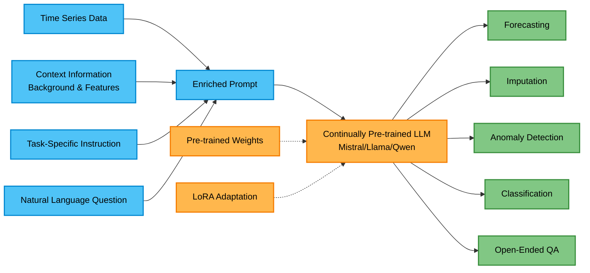

# Review of "Time-MQA: Time Series Multi-Task Question Answering with Context Enhancement"

Kong et. al.

Review by Jason Gillette

## Summary of Paper

### Introduction

This paper introduces Time-MQA, a framework that for time series analysis through natural language question answering. The paper details and addresses limitations in current time series research. Most notably, the fragmentation of analysis tasks and data into isolated objectives like forecasting, anomaly detection, and classification. While other works explore Large Language Models (LLMs) for time series analysis, existing approaches remain limited to single tasks. Time-MQA supports time series data through natural language queries for both traditional numerical tasks and complex open-ended reasoning questions. To train Time-MQAm the authors creates TSQA, a dataset containing approximately 200,000 question-answer pairs spanning twelve domains. THeir experiment demonstrates that continually pre-training open source LLMs on this dataset enhances their ability to understand temporal patterns and provide cross domain insights beyond basic numerical analysis.

### Research Questions

The authors do not explicitly state research questions in the paper. However, based on the identified contributions and the proposed framework, the implicit research questions they seek to address appear to be the following.

1. How can diverse time series analysis tasks be addressed with a single question-answering model that supports natural language interaction?
2. Can Large Language Models be effectively adapted to handle both numerical time series computations and complex reasoning about temporal patterns when enhanced with contextual information?
3. What dataset characteristics are required to enable LLMs to address both traditional numerical analysis and cognitive understanding of time series data?

### Research Contributions

The authors explicitly list three main contributions.

1. Time-MQA Framework - Their multi-task time series question answering framework that leverages contextual enhancement to perform traditional numerical analysis tasks and complex reasoning across time series tasks, e.g., forecasting, imputation, classification, anomaly detection, and open-ended queries.
2. TSQA Dataset - A large-scale dataset comprising approximately 200,000 question-answer pairs spanning over twelve domains (healthcare, finance, energy, traffic, environment, IoT, nature, transport, human activities, machine sensors, AIOps, and web) and five distinct tasks. This is presented as the first comprehensive QA dataset in the time series domain that bridges traditional analysis and natural language interaction.
3. LLM Adaptation Demonstration - Empirical data that fine-tuning large language models on the TSQA dataset successfully performs time series-specific knowledge and reasoning capabilities.

## System Architecture

The Time-MQA framework uses a three-stage architecture that transforms multi-modal inputs into task-specific responses through continually pre-trained large language models. According to the authors, contextual information *C* is extracted from the original data sources and includes background information, feature descriptions, and task descriptions as textual information. This context is integrated directly into the prompt structure, as shown in the paper's examples where prompts begin with "Context" followed by dataset-specific metadata (e.g., "This dataset aims to estimate heart rate during physical exercise using wrist-worn sensors."). The system takes three inputs; (1) raw time series data `X = {x1, x2, ..., xt}`, (2) the contextual information *C*, and (3) task-specific prompts *Q* as natural language.

The framework used continually pre-trained LLMs, which simply involves further training existing pre-trained models on a combined dataset of 70% TSQA data and 30% general QA corpus from OpenOrca to ensure adequate time-series domain learning while maintaining generalized QA capabilities. To optimize parameter usage, the system employs Parameter-Efficient Fine-Tuning (PEFT) with LoRA (Low-Rank Adaptation) adapters. LoRA reduces computational requirements by training only certain parameters rather than updating all model parameters.

### Simplified Architecture Diagram

## Methodology

### Experiment Design

The authors conducted experiments using three models with the TSQA dataset. For evaluation, they sampled from the TSQA dataset by randomly selecting 1,400 QA pairs for each of the four numerical task types, i.e., forecasting, imputation, anomaly detection, and classification, and manually sampled 1,400 QA pairs for open-ended reasoning, resulting in 7,000 QA pairs total. To maintaining general QA capabilities, they combined this TSQA subset with a general QA corpus from OpenOrca at a 70% to 30% ratio, resulting in 10,000 training QA pairs total. They noted all training was conducted on a single A100 80GB GPU.

For evaluation against baseline models, the authors randomly selected 50 QA pairs for each task type and question format to assess model performance. They compared their fine-tuned models against GPT-4o and Doubao, using MSE for forecasting and imputation tasks and accuracy for anomaly detection, classification, and open-ended reasoning tasks. Additionally, they conducted a user study with 78 participants from diverse backgrounds to evaluate the subjective quality of responses, particularly for open-ended reasoning tasks where automated metrics may not fully capture response quality.

### TSQA Dataset Statistics

- Total QA pairs: ~192,843
- 12 domains (healthcare, finance, energy, traffic, environment, IoT, nature, transport, human activities, machine sensors, AIOps, web)
- 5 task types (forecasting, imputation, anomaly detection, classification, open-ended reasoning QA)
- Task distribution: Forecasting (22.07%), Imputation (20.05%), Open-Ended QA (19.52%), Classification (19.18%), Anomaly Detection (19.18%)
- Open-ended QA breakdown: 6,919 true/false questions, 11,281 multiple-choice questions, 12,510 open-ended questions

### Models Tested

- Mistral 7B
- Llama-3 8B
- Qwen-2.5 7B
- GPT-4o (baseline comparison)
- Doubao (baseline comparison)

## Results & Analysis

The experimental results demonstrate that fine-tuning LLMs on the TSQA dataset generally improved performance across multiple time series tasks. For numerical tasks, the fine-tuned Mistral 7B achieved the best forecasting performance with an MSE of 1.35, outperforming GPT-4o (1.79) and the other fine tuned models (Llama-3 8B: 2.01, Qwen-2.5 7B: 1.82). The authors note that the relatively high MSE values across all models were attributed to the challenging of long range time series in the dataset. However, for imputation tasks, MSE values remained consistently low across all models, with Mistral 7B achieving the best performance (0.014), suggesting that extensive temporal data aids in missing value reconstruction. In anomaly detection, Qwen-2.5 7B led with 68% accuracy, while classification tasks showed Qwen-2.5 7B achieving the highest accuracy at 52%, outperforming GPT-4o at 32%. For open-ended reasoning tasks, the fine-tuned models showed substantial improvements. Qwen-2.5 7B achieved the highest accuracy (82%) on true/false judgment questions, while Mistral 7B did best on multiple-choice questions at 64%. The ablation study comparing TSQA-tuned versus zero-shot Mistral 7B confirmed the dataset's value, showing improvements from 78% to 80% on judgment tasks and 60% to 64% on MCQ tasks. The user study with 78 participants revealed that Mistral 7B was preferred by 70.5% of respondents for overall quality. Participants highlighted Mistral's logical structure and clarity, while Qwen-2.5 7B was noted for providing more thorough and comprehensive reasoning. Note that lower MSE is better.

### Best of Numerical Tasks

- Forecasting: Mistral 7B (MSE: 1.35)
- Imputation: Mistral 7B (MSE: 0.014)
- Anomaly Detection: Qwen-2.5 7B (Accuracy: 0.68)
- Classification: Qwen-2.5 7B (Accuracy: 0.52)

### Best of Open-Ended Reasoning Tasks

- Judgment (True/False): Qwen-2.5 7B (Accuracy: 0.82)
- Multiple Choice Questions: Mistral 7B (Accuracy: 0.64)

## Summary of Strengths

**Comprehensive Dataset Construction and Multi-Domain Coverage** - The TSQA dataset represents the greatest contribution with ~200k QA pairs spanning 12 domains and 5 distinct tasks. Existing datasets focus on either numerical or cognitive tasks, but TSQA successfully captures both categories over multiple tasks. This resource addresses a critical gap in the field.

## Summary of Weaknesses

**Unclear Evaluation Methodology and Scale Mismatch** - The paper describes creating 10,000 training QA pairs but evaluates models on only 50 samples per task. This reduction that raises questions about statistical significance. The rationale for this dramatic down sampling isn't explained, whether due to computational constraints or other factors. This limited evaluation set undermines confidence in the reported improvements, especially when some gains are marginal (2-4%).

**Ambiguous Context Integration Mechanism** - The paper fails to clarify how contextual information is matched and appended to user queries in practical deployment. While examples show context prepended to prompts during training, it's unclear whether this requires manual programming, uses retrieval mechanisms, or expects users to provide context. This is a implementation detail that affects real-world applicability.

**Marginal Improvements Despite Significant Training Investment** - Several improvements are modest—Mistral's 2% gain on judgment tasks (78% to 80%) and 4% on MCQ (60% to 64%) raise questions about cost-effectiveness. The paper acknowledges high MSE values for long time series remain problematic, suggesting the approach hasn't fully addressed fundamental challenges. An ablation study examining whether users perceive these marginal improvements would strengthen the contribution.

## Questions for the Authors

1. The authors detail sampling a 10,000 QA subset for evaluation, but later mention the sampling of 50 QA pairs per task for their comparison against baseline models? Did they evaluate all models on 50 QA pairs per task, or just the baselines? Why not use the full test set, cost?
2. How does the framework append the correct context, including metadata and task description to a prompt given a user question? Is this manually programmed for the evaluation or is there a retrieval mechanism based on user input?
3. The paper notes that evaluated models demonstrated a drop in performance due to long range time series. Would longer context windows improve performance over long range temporal data? An additional study that includes increased context windows would provide valuable insights regarding this issue.

## Reference

Kong, Y., Yang, Y., Hwang, Y., Du, W., Zohren, S., Wang, Z., Jin, M., & Wen, Q. (2025). *Time-MQA: Time Series Multi-Task Question Answering with Context Enhancement.* arXiv preprint [arXiv:2503.01875](https://arxiv.org/abs/2503.01875).
