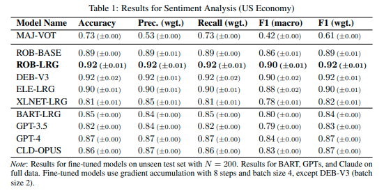
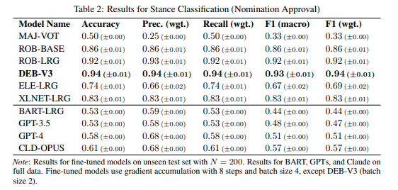
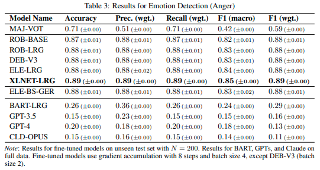
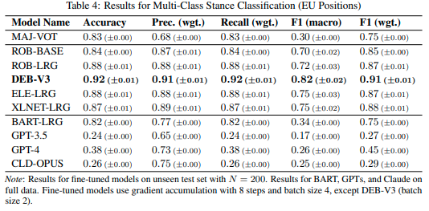
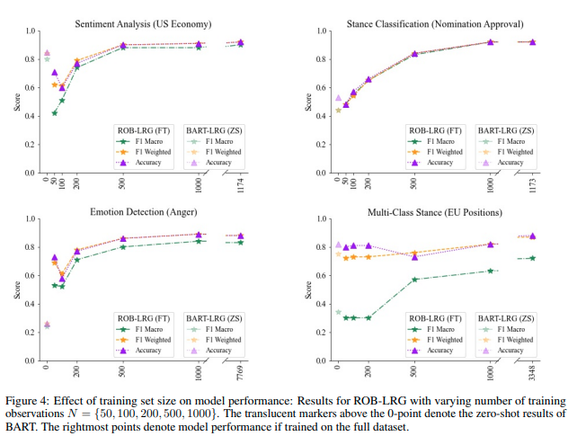

<!-- title slide with split layout and background image -->

# Fine-Tuned Small LLMs vs. Zero-Shot Generative AI in Text Classification

**Jason Gillette**

**University of Texas at San Antonio**

**October 21st, 2024**

<!-- _class: split -->

---

# Introduction

- Paper: *FINE-TUNED SMALL LLMS (STILL) SIGNIFICANTLY OUTPERFORM ZERO-SHOT GENERATIVE AI MODELS IN TEXT CLASSIFICATION*
- Authors: Martin Juan José Bucher (Stanford), Marco Martini (University of Zurich)
- **Research Focus**: 
  - Smaller fine-tuned models vs. zero-shot generative models (e.g., ChatGPT, Claude Opus)

<!-- Used papers with code website to discover this paper -->
---

# Problem Statement

- **Generative AI’s Promise**: No need for task-specific fine-tuning and labeled data.
- **Research Question**: 
  - Can generative AI models like ChatGPT outperform fine-tuned small LLMs?
- **Importance**: Understanding trade-offs between generative and fine-tuned models.

---

# Background on Fine-Tuned LLMs

- **Pre-training and Fine-tuning**:
  - Smaller models RoBERTa Base, RoBERTa Large, DeBERTa V3, Electra Large, and XLNet are pre-trained on large corpora.
  - Fine-tuning adapts models to specific tasks like sentiment analysis.
- **Previous State-of-the-Art**:
  - Fine-tuned LLMs outperform traditional methods like BoW and pre-transformer architectures.
  - Some generative models have outperformed fine-tuned models, yet empirical evidence is not conclusive.

---

# Zero-Shot Generative Models

- **Generative AI Models**:
  - GPT-3.5, GPT-4, Claude Opus, and BART prompt-based models without further training.
- **Zero-Shot Approach**:
  - No labeled training data required. 
  - *Q: The sentiment of <text> is... A:*
  - Generates outputs based on pre-trained *general* knowledge.
- **Appeal**: Simplicity and scalability.

---

# Methodology – Overview

- **Task Setup**:
  - Four text classification tasks: sentiment analysis, stance classification (approval/disapproval), emotion detection, multi-class text classification.
  - Datasets: News, tweets, speeches, political texts (English & German).
- **Model Comparison**:
  - Fine-tuned small LLMs vs. zero-shot generative models.
- **Metrics**: Accuracy, Precision, Recall, F1-scores.

---

# Case Study 1: Sentiment Analysis

- **Task**: Classify positive/negative sentiment in The New York Times articles.
- **Results**:
  - Fine-tuned models (RoBERTa, DeBERTa): ~90% accuracy.
  - Zero-shot models (ChatGPT, Claude): ~82-87% accuracy.
- **Key Insight**: Fine-tuning captures sentiment nuances better.

---

# Case Study 1: Sentiment Analysis Results

Roberta Large closest zero-shot model by ~5%

---

# Case Study 2: Stance Classification

- **Task**: Classifying support/opposition in tweets about SCOTUS nomination.
- **Results**:
  - Fine-tuned models (DeBERTa, RoBERTa): ~94% accuracy.
  - Zero-shot models: Perform slightly better than baseline (50-60% accuracy).
- **Key Insight**: Zero-shot models struggle with nuanced stance classification.

---

# Case Study 2: Stance Classification Results

DeBERTa performs over twice as well as zero-shot model.

---

# Case Study 3: Emotion Detection

- **Task**: Detecting anger in German political texts.
- **Results**:
  - Fine-tuned models: ~88-89% accuracy.
  - Zero-shot models: Perform poorly (~15-20% accuracy).
- **Translation Experiment**: Minimal difference between German and translated English performance.
- **Key Insight**: Zero-shot models struggle with specialized tasks.

---

# Case Study 3: Emotion Detection Results

XLNET-Large performs 3x to 8x better than zero-shot prompting.

---

# Case Study 4: Multi-Class Stance Classification

- **Task**: Predicting party positions on EU integration.
- **Results**:
  - Fine-tuned models: ~92% accuracy.
  - Zero-shot models struggle with multi-class classification.
- **Key Insight**: Fine-tuned models handle complex tasks better.

---

# Case Study 4: Multi-Class Stance Classification Results

Again, DeBERTa out performs zero-shot prompting.

---

# Impact of Training Data Size

- **Ablation Study**: Effect of varying training set size on performance.
- **Findings**:
  - Performance improves with larger training data, plateaus after ~500 samples.
  - Fine-tuned models outperform zero-shot models after just 200 samples.
- **Conclusion**: Moderate amounts of training data improve fine-tuned models significantly.

---

# Ablation Study Results

Significant improvements up to n=500 balanced observations.

---

# Why Fine-Tuning Prevails

- **Application-Specific Data**: Fine-tuned models gain task-specific knowledge.
- **Fine-Tuning Strengths**: Better at capturing nuanced distinctions.
- **Limitations of Zero-Shot Models**: Struggle with niche, specialized tasks.

---

# Future Directions in Generative AI and Fine-Tuning

- **Few-Shot Learning**: Potential to bridge the gap between zero-shot and fine-tuned models.
- **Data Augmentation**: Techniques like back-translation and token perturbation can reduce the need for large labeled datasets.
- **Model Architecture**: Multi-modality and quality improvements in generative models.

---

# Conclusion and Takeaways

- **Summary of Key Findings**:
  - Fine-tuning outperform zero-shot models in specialized tasks.
  - Zero-shot models are easy but struggle with domain-specific tasks.
- **Toolkit Availability**:
  - Accessible Jupyter Notebook for text classification fine-tuning.
  - Supports binary and non-binary tasks.
  - Supports class imbalances in data.
- **Final Remark**: Fine-tuned LLMs are still relevant.

---

# Q&A

- How would few-shot prompting compare?
- Was zero-shot evaluation performed in a single prompt or per sample and how might this impact results?
 
Bucher, M. J. J., & Martini, M. (2024). Fine-tuned 'small' LLMs (still) significantly outperform zero-shot generative AI models in text classification. arXiv preprint arXiv:2406.08660.